# Lab 08: Design Power BI reports

## Lab scenario

In this lab, you'll create a three-page report. You'll then publish it to the Power BI service, where you'll open and interact with the report.

In this lab you learn how to:

- Design a report.
- Configure visual fields and format properties.
- Sync slicers.
- Publish the report to the Power BI service.
- Interact with a report and its visuals.

## Lab objectives
In this lab, you will perform:

- Design a report
- Configure visual fields and format properties
  
## Estimated timing: 60 Minutes    

## Architecture Diagram

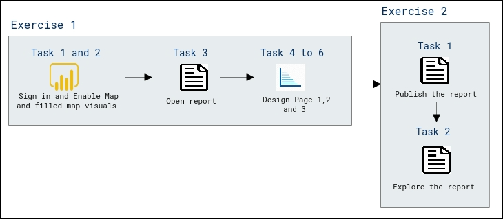   

## Exercise 1: Create a Report

In this exercise you will create a three-page report named **Sales Report**.

### Task 1: Get started – Sign in

In this task you will setup the environment for the lab by signing in to Power BI.

1. To open Microsoft Edge, on the taskbar, click the Microsoft Edge.

 	

1. In the Microsoft Edge browser window, navigate to **https://powerbi.microsoft.com**.

 	**Tip:** You can also use the Power BI Service favorite on the Microsoft Edge favorites bar.

1. Click **Sign In** (located at the top-right corner).

 	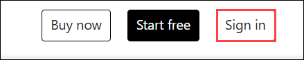

1. Enter the account details 

   - In the **Email (1)** field, enter your email address, and then select **Submit (2)**.

     * Azure Username/Email: <inject key="AzureAdUserEmail"></inject> 

	 	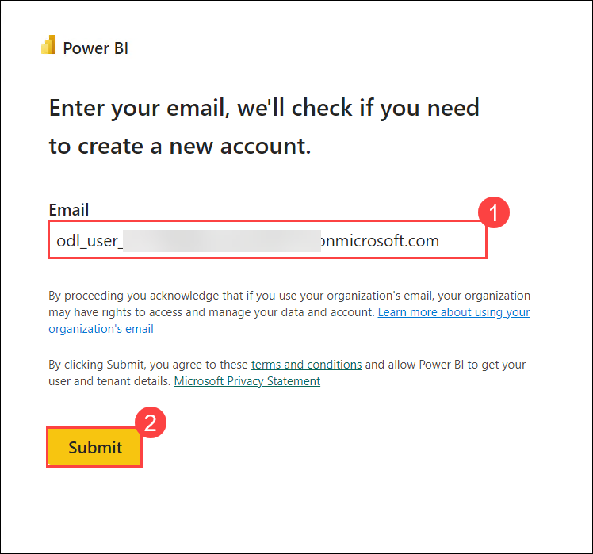

   - Enter the Temporary Access Pass, and then select **Sign in**.
   
     * Azure Password: <inject key="AzureAdUserPassword"></inject>

	 	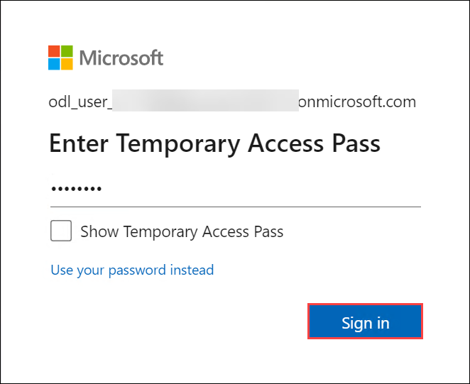
 
1. If prompted to update the password, reenter the provided password, and then enter and confirm a new password.

 	**Important**: Be sure to record your new password.

1. Complete the sign in process by clicking on **Continue**

   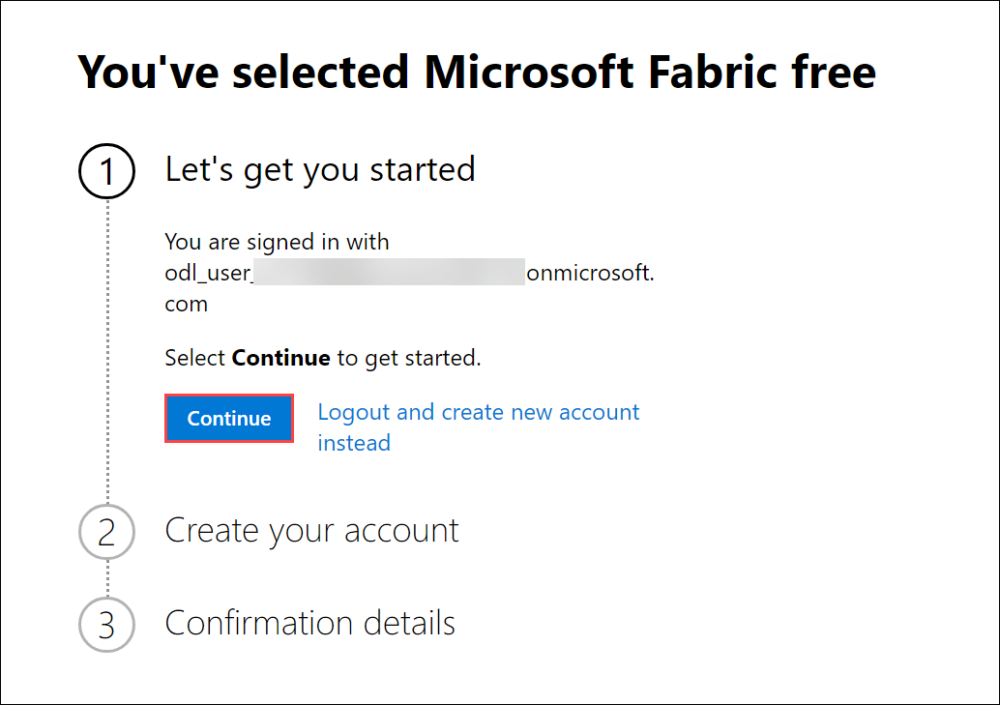
   
1. Enter a job titel and 10 digit phone number and select Get started. Select Get started once more. You will be redirected to Power BI.
   
   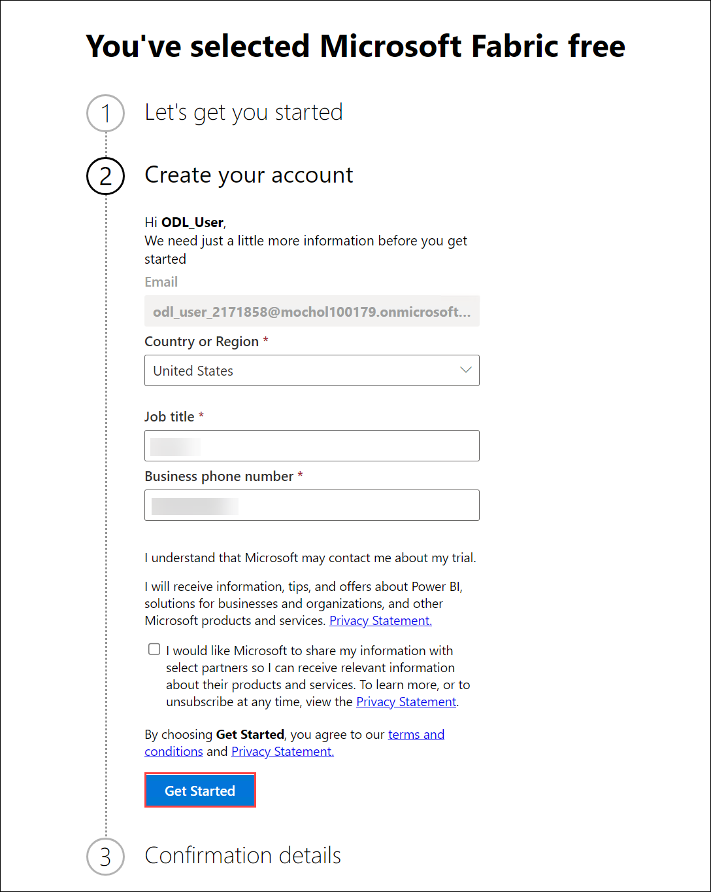
   
   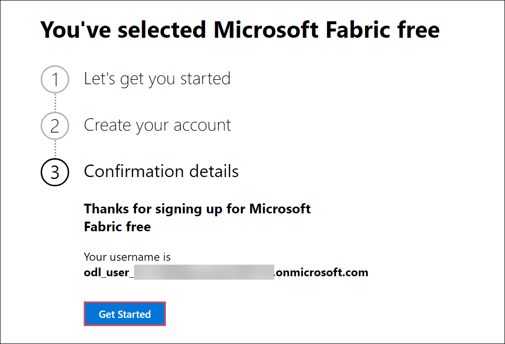

1. If prompted by Microsoft Edge to stay signed in, click **No**.

1. Leave the Microsoft Edge browser window open.

### Task 2: Get started – Enable Map and filled map visuals

In this task you will enable map and filled map visuals in the environment for the lab by updating the Integration settings in the Power BI Admin portal. 

1. To open the Power BI Admin portal, at the top-right corner of the browser, click on the ellipses and then select the **Settings (1)** icon.

1. Select **Admin portal (2)**.

   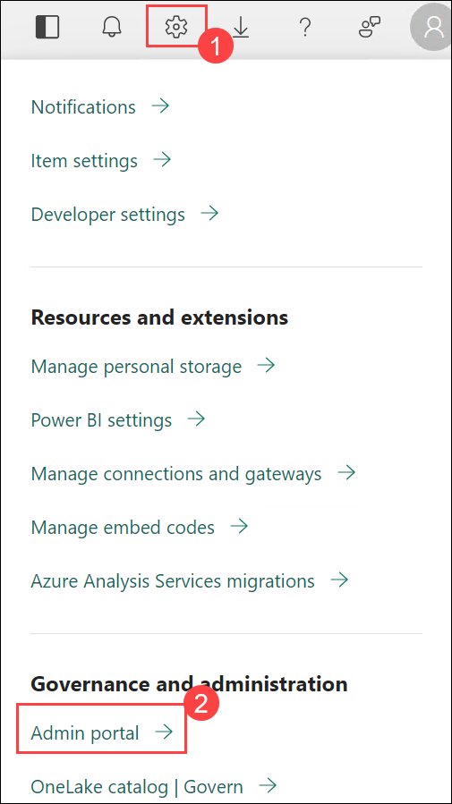

1. Scroll down the page to Integration settings. Click the arrow to expand the Map and filled map visuals option.

   .png)

1. Set the Map and filled map visuals option to **Enabled**.

   >**Note:** If the Map and filled map visuals is **Enabled** skip the step.

1. Click **Apply**, to apply the changes. 

   

1. A message will appear at the top-right of the browser stating the Tenant settings changes will be applied within the next 15 minutes. 

   .png)

1. Leave the Microsoft Edge browser window open.

### Task 3: Get started – Open report

In this task you will setup the environment for the lab by opening the starter report.

1. Click the Microsoft **Power BI Desktop** shortcut icon to open.

 	

1. To open the starter Power BI Desktop file, click the **Open (1)** button at left panel and select **Browse this device (2)**.

	

1. In the **Open** window, navigate to the **C:\PL300\PL-300-Microsoft-Power-BI-Data-Analyst-Main\Allfiles\Labs\08-design-power-bi-reports (1)** folder. Select the **08-Starter-Sales Analysis (2)** file and click **Open (3)**.

   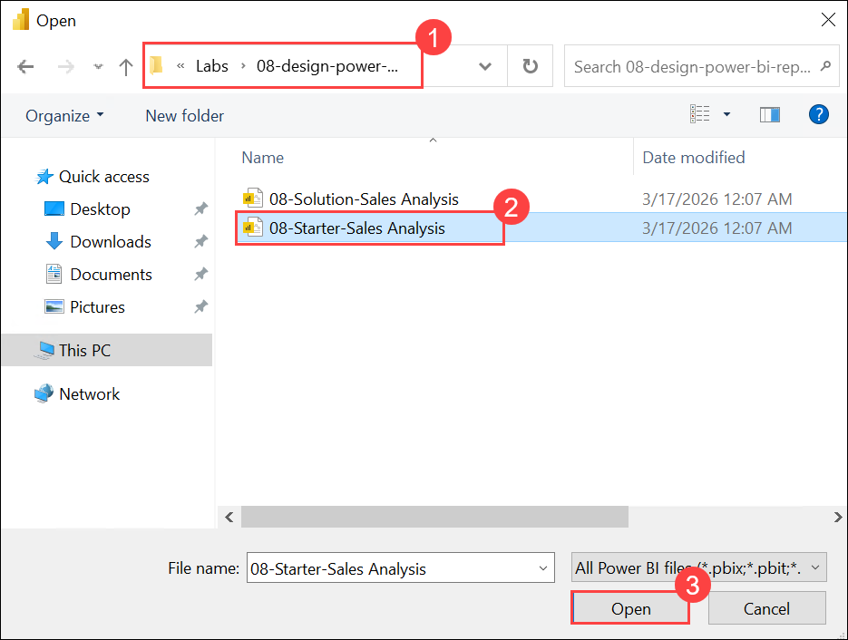

1. Close any informational windows that may open.

1. If prompted to apply changes, click **Apply Later**.

    

### Task 4: Design page 1

In this task you will design the first report page. When you’ve completed the design, the page will look like the following:

   .png)

1. In Power BI Desktop, to rename the page, at the bottom-left, right-click **Page 1**, and then select **Rename**.

	 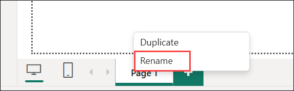

	 *Tip: You can also double-click the page name to rename it.*

1. Rename the page as **Overview**, and then press **Enter**.

	

1. To add an image, on the **Insert** ribbon tab, from inside the **Elements** group, click **Image**.

	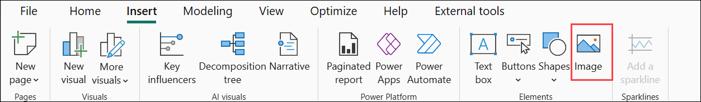

1. In the **Email** field, enter your email address, and then select **Continue**.

	 * Azure Username/Email: <inject key="AzureAdUserEmail"></inject> 

	  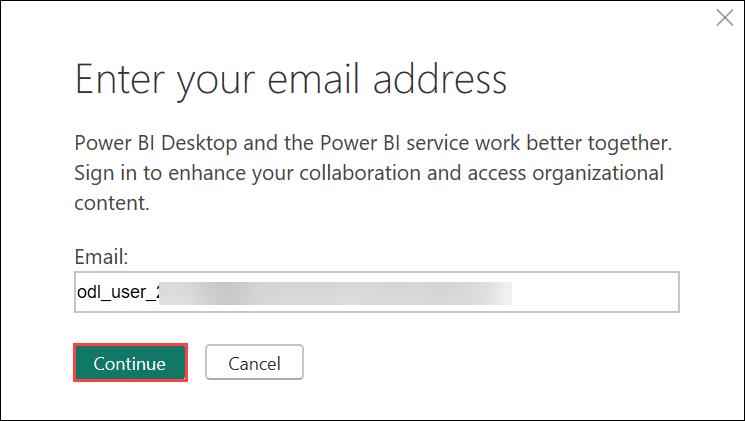

1. Enter your email address, and then select **Next**. 

	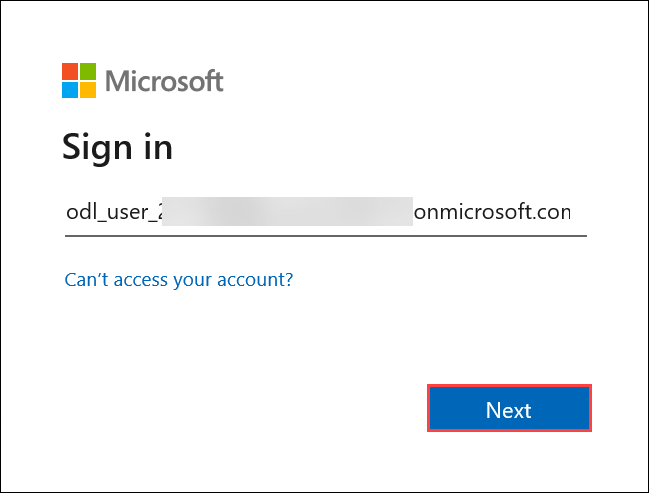

1. Enter the Temporary Access Pass, and then select **Sign in**.
   
     * Azure Password: <inject key="AzureAdUserPassword"></inject>

	   

1. On the **Sign in to all apps and websites on this device?** screen, select **No, this app only**.

	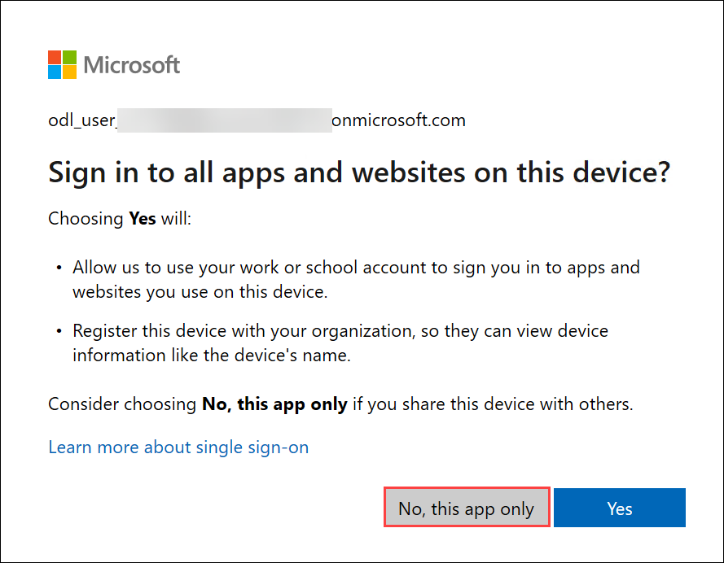

1. In the **Format image** pane, expand **Style (1)**, expand **Image (2)**, and then select **Browse... (3)** to upload an image.

	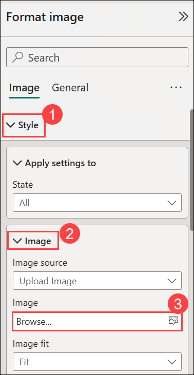

1. In the **Open** window, navigate to the **C:\PL300\PL-300-Microsoft-Power-BI-Data-Analyst-Main\Allfiles\Labs\08-design-power-bi-reports (1)** folder.

1. Select the **AdventureWorksLogo (2)** file, and then click **Open (3)**.

	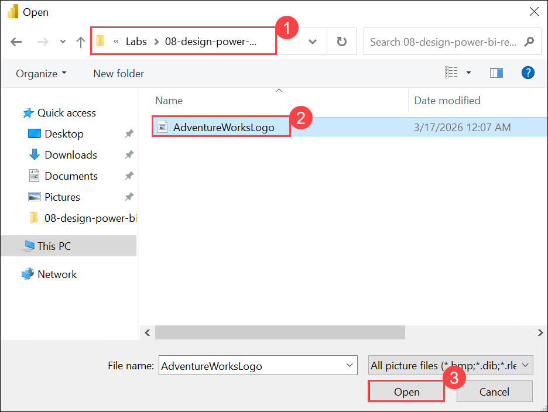

1. Drag the image to position it at the top-left corner, and also drag the guide markers to resize it.

	

1. To add a slicer, first de-select the image by clicking an empty area of the report page.

1. In the **Data** pane, select the **Date \| Year** field (not the **Year** level of the hierarchy).
	
	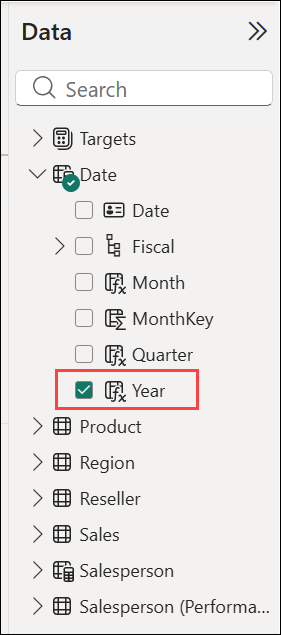

	>**Note:** The labs use a shorthand notation to reference a field. It will look like this: **Date \| Year**. In this example, **Date** is the table name and **Year** is the field name.

1. Notice that a table of year values has been added to the report page.

1. To convert the visual from a table to a slicer, in the **Visualizations** pane, select the **Slicer**.

	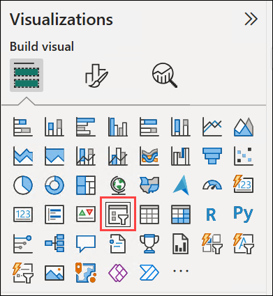

1. To convert the slicer from a list to a dropdown, in the **Visualizations** pane, select **Format visual (1)**. Expand **Slicer settings (2)**, and then set the **Style** dropdown to **Dropdown (3)**.

	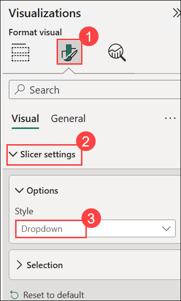

1. Resize and position the slicer so it sits beneath the image and is the same width as the image.

	

1. In the **Year** slicer, open the dropdown list, select **FY2020**, and then collapse the dropdown list.

	.png)

	>**Note**: The report page is now filtered by year **FY2020**.

1. De-select the slicer by clicking an empty area of the report page.

1. Create a second slicer, based on the **Region \| Region** field (not the **Region** level of the hierarch).

	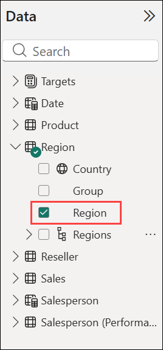

1. To convert the visual from a table to a slicer, in the **Visualizations** pane, select the **Slicer**.

	

1. Leave the slicer as a list, and then resize and position the slicer beneath the **Year** slicer.

	

1. De-select the slicer by clicking an empty area of the report page.

1. To add a chart to the page, in the **Visualizations** pane, click the **Line and Stacked Column Chart** visual type.

	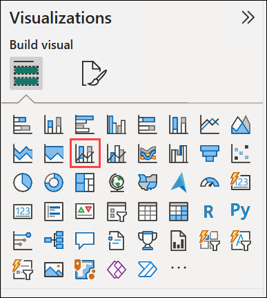

1. Resize and position the visual so it sits to the right of the logo, and so it fills the width of the report page.

	

1. Drag and drop the following fields into the visual:

	- Date \| Month

	- Sales \| Sales

1. In the visual fields pane (located beneath the **Visualizations** pane), notice that the fields are assigned to the **X-axis** and **Column y-axis** wells/areas.

	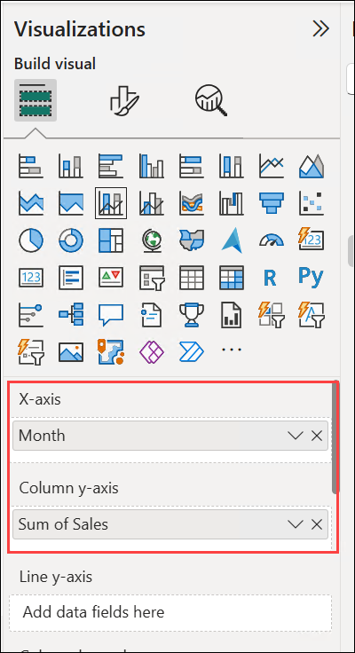

	>**Note:** By dragging fields into a visual, they will be added to default wells/areas. For precision, you can drag fields directly into the wells/areas, as you will do next.

1. From the **Data** pane, drag the **Sales \| Profit Margin** field into the **Line y-axis** well/area.

	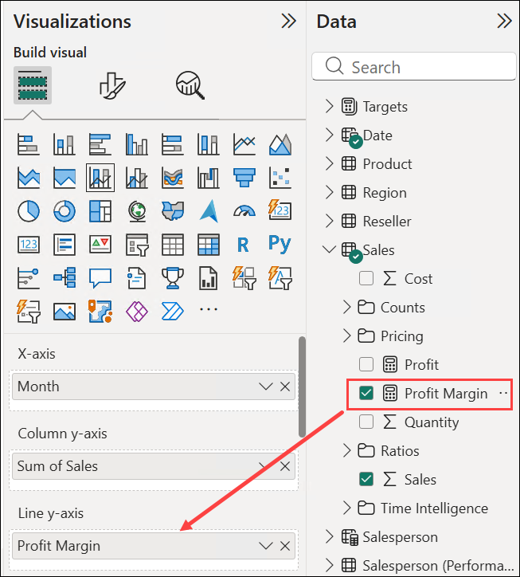

1. Notice that the visual has 11 months only.

	>**Note:** The last month of the year, 2020 June, does not have any sales (yet). By default, the visual has eliminated months with BLANK sales. You will now configure the visual to show all months.

1. In the visual fields pane, in the **X-axis** well/area, for the **Month (1)** field, click the down-arrow, and then select **Show Items With No Data (2)**.

	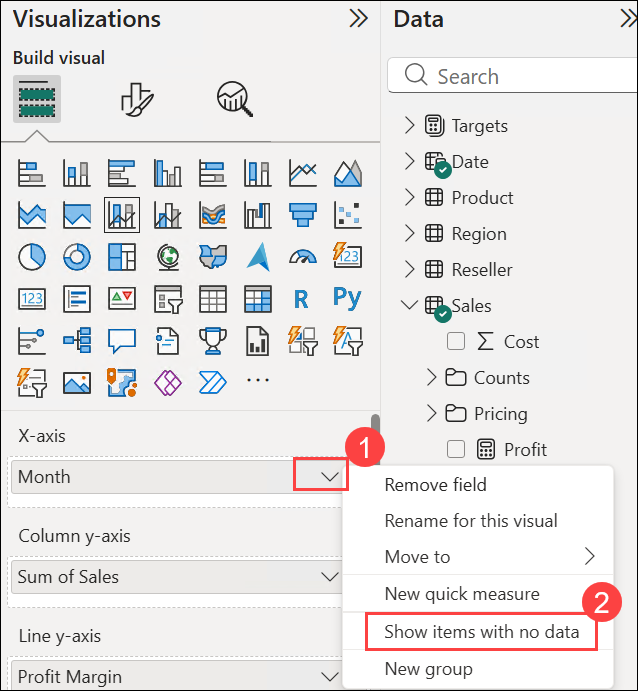

1. Notice that the month **2020 June** now appears.

1. De-select the chart by clicking an empty area of the report page.

1. To add a chart to the page, in the **Visualizations** pane, click the **Stacked column chart** visual type.

	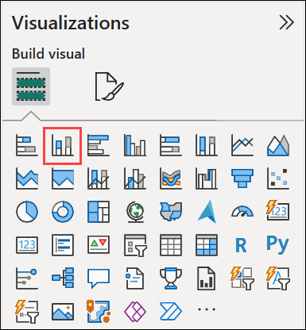

1. Resize and position the visual so it sits beneath the column/line chart, and so it fills half the width of the chart above.

	

1. Add the following fields to the visual wells/areas:

	- X-axis: **Region \| Country**

	- Y-axis: **Sales \| Sales**

	- Legend: **Product \| Category**

1. De-select the chart by clicking an empty area of the report page.

1. To add a chart to the page, in the **Visualizations** pane, click the **Stacked Bar Chart** visual type.

	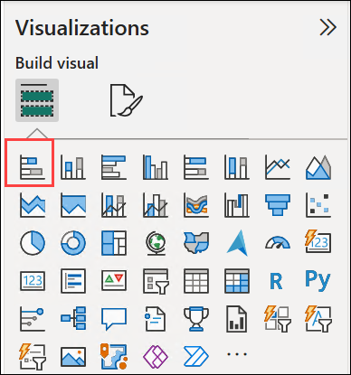

1. Resize and position the visual so it fills the remaining report page space.

	

1. Add the following fields to the visual wells/areas:

	- Y-axis: **Product \| Category**

	- X-axis: **Sales \| Quantity**

1. To format the visual, open the **Format (1)** pane.

1. Expand the **Bars (2)** and then the **Colors** group, and then set the **Default Color** property to a suitable color (to complement the column/line chart).

	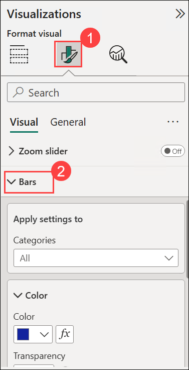

1. Set the **Data Labels** property to **On**.

	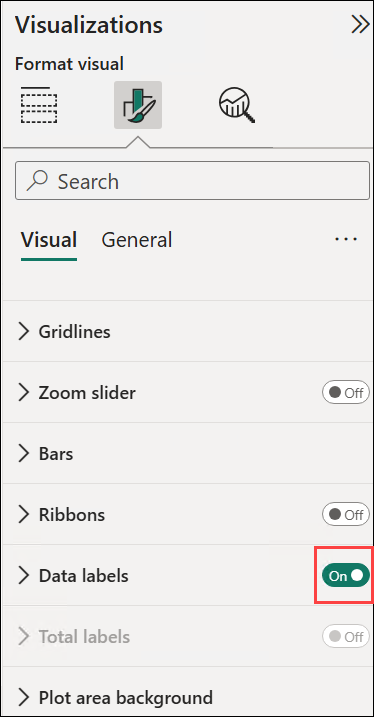

1. Save the Power BI Desktop file.

	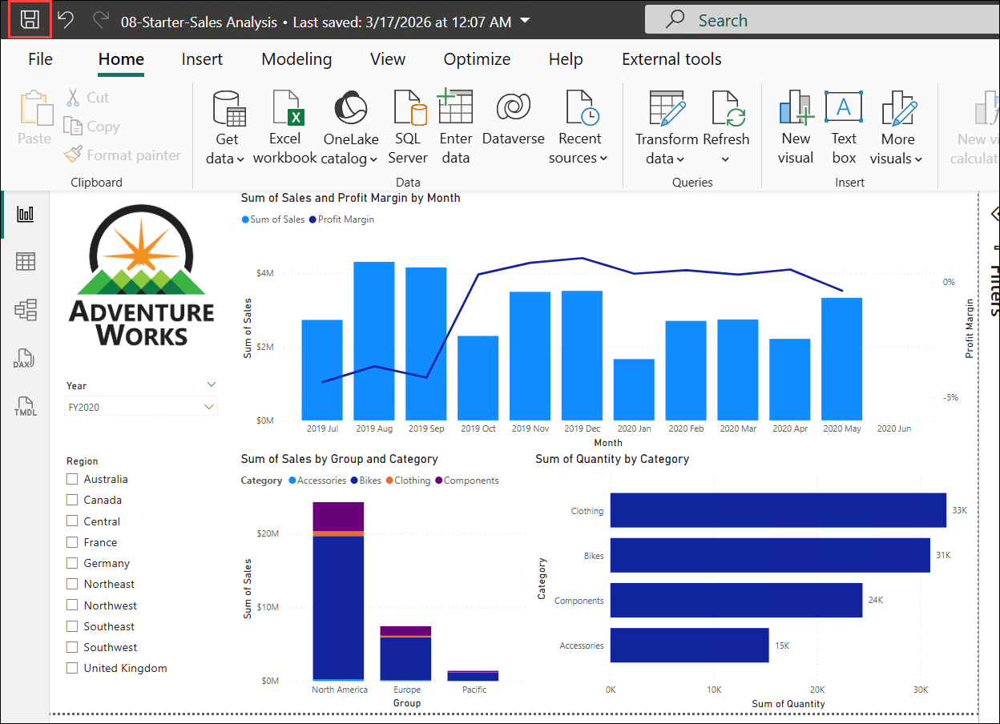

	>**Note:** The design of the first page is now complete.
 
### Task 5: Design page 2

In this task you will design the second report page. When you’ve completed the design, the page will look like the following:

.png)

**Important**: When detailed instructions have already been provided in the labs, the lab steps will provide more concise instructions. If you need the detailed instructions, you can refer back to other tasks in this lab.

1. To create a new page, at the bottom-left, click the plus icon.

	

2. Right-click **Page 1**, select **Rename**, and then enter **Profit**.

	

3. Add a slicer based on the **Region \| Region** field.

	

1. To convert the visual from a table to a slicer, in the **Visualizations** pane, select the **Slicer**.

	

4. Use the **Visualizations > Format visual (1)> Visual > Slicer Settings (2) > Selection (3)** pane to enable the “**Select All (4)**” option.

	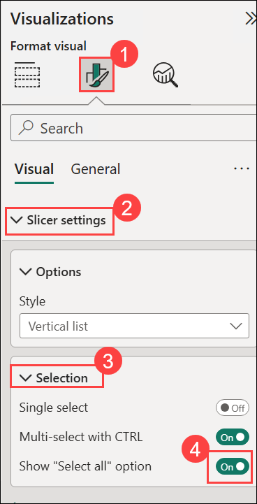

5. Resize and position the slicer so it sits at the left side of the report page, and so it is about half the page height.

	

1. De-select the slicer by selecting an empty area of the report page.

6. Add a **Matrix** visual, and resize and position it so it fills the remaining space of the report page

	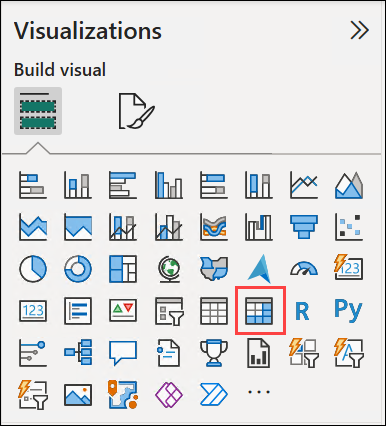

	

7. Add the **Date \| Fiscal** hierarchy to the matrix **Rows** well/area.

	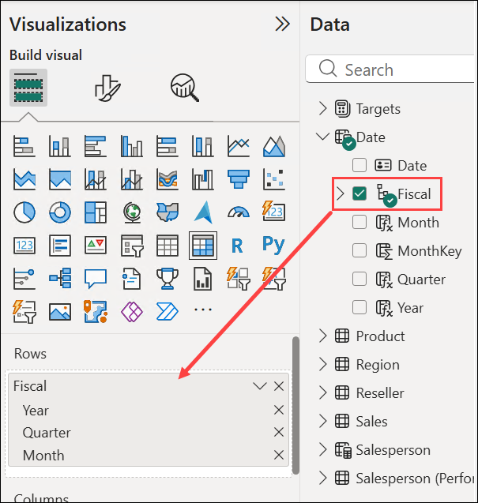

8. Add the following five **Sales** table fields to the **Values** well/area:

	- Orders (from the **Counts** folder)

	- Sales

	- Cost

	- Profit

	- Profit Margin

	  >**Note:** The fields will show in the visual with a prefix showing the aggregation type; "Sum of Sales."

	 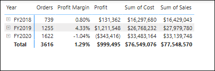

9. In the **Filters** pane (located at the left of the **Visualizations** pane), notice the **Filter On This Page** well/area (you may need to scroll down).

	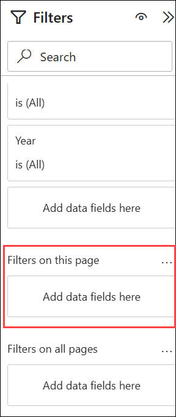

10. From the **Data** pane, drag the **Product \| Category** field into the **Filter On This Page** well/area.

	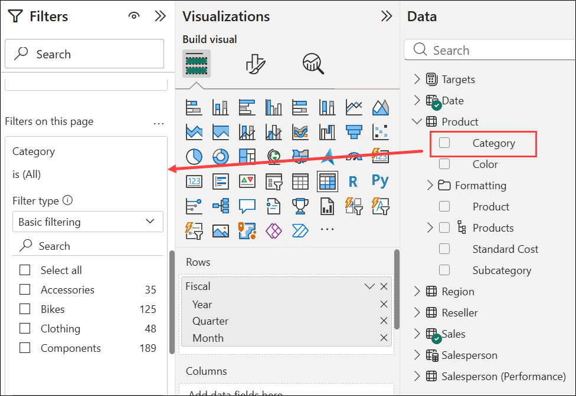

11. Inside the filter card, at the top-right, click the arrow to collapse the card.

	.png)

	>**Note**: Fields added to the **Filters** pane can achieve the same result as a slicer. One difference is they don’t take up space on the report page. Another difference is that they can be configured to achieve more sophisticated filtering requirements.

12. Add each of the following **Product** table fields to the **Filter On This Page** well/area, collapsing each, directly beneath the **Category** card:

	- Subcategory

	- Product

	- Color

	  .png)

13. Save the Power BI Desktop file.

	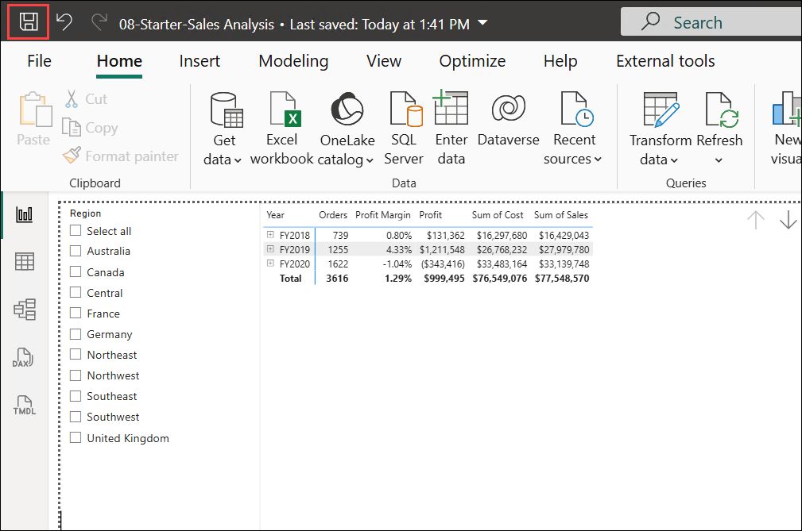

	>**Note:** The design of the second page is now complete.

### Task 6: Design page 3

In this task you will design the third—and final—report page. When you’ve completed the design, the page will look like the following:

.png)

1. Create a new page, and then rename it as **My Performance**.

	

1. To simulate the performance of row-level security filters, drag the **Salesperson (Performance) \| Salesperson** field to the page level filters in the filter pane.
	
	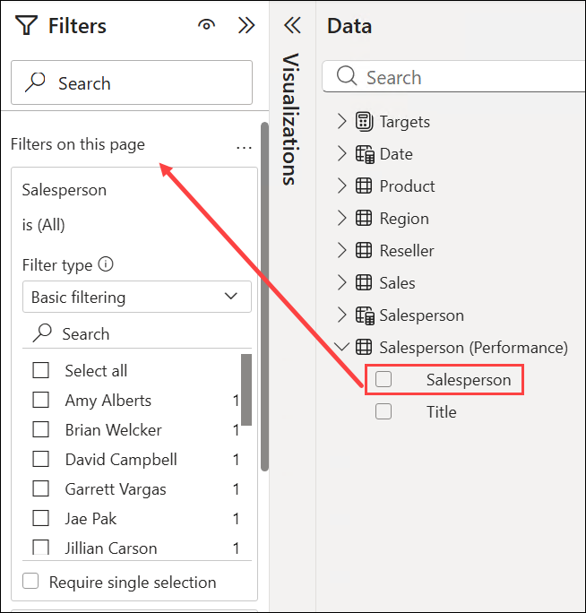

1. Select **Michael Blythe**. Data on the **My Performance** report page will now be filtered to display data for Michael Blythe only.

1. From the **Visualizations** pane, select **Slicer**, drag **Date | Year** into the field well.

	

1. To convert the slicer from a list to a dropdown, in the **Visualizations** pane, select **Format visual (1)**. Expand **Slicer settings (2)**, and then set the **Style** dropdown to **Dropdown (3)**.

	
	
1. In the slicer, set the page to filter by **FY2019**.

	.png)

1. Add a **Multi-row Card** visual, and then resize and reposition it so it sits to the right of the slicer and fills the remaining width of the page.

	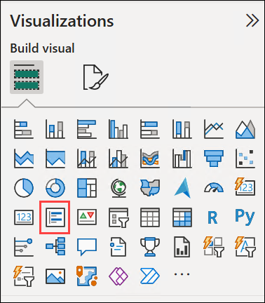

	

1. Add the following four fields to the visual:

	- Sales \| Sales

	- Targets \| Target

	- Targets \| Variance

	- Targets \| Variance Margin

1. To format the visual, open the **Format visual** pane.
   
   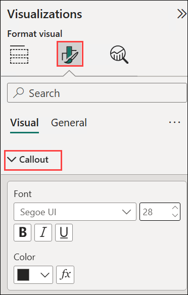

	 - In the **Callout values** section, increase the font size property to **28pt**.
     
	 - In the **General** tab, in the **Effects** section, set the background color property to a light gray color (such as _White, 10% Darker_) to provide contrast.
	  
	   

1. Add a **Clustered Bar Chart** visual, and then resize and position it so it sits beneath the multi-row card visual and fills the remaining height of the page, and half the width of the multi-row card visual.

	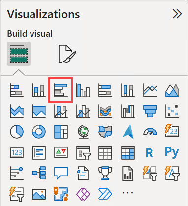

	

1. Add the following fields to the visual wells/areas:

	- Y-axis: **Date \| Month**

	- X-axis: **Sales \| Sales** and **Targets \| Target**

	.png)

1. To create a copy of the visual, press **Ctrl+C**, and then press **Ctrl+V** and drag him to the side.

1. Position the new visual to the right of the original visual.

	

1. To modify the visualization type, in the **Visualizations** pane, select **Clustered Column Chart**.

	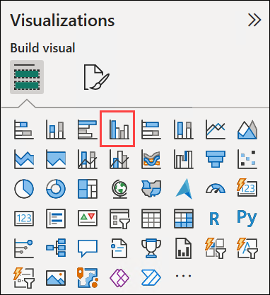

	>**Note:** It's now possible to see the same data expressed by two different visualization types

	>**Note**: The design of the third and final page is now complete.
	
## Task 7: Sync slicers

In this task, you'll sync the _Year_ and _Region_ slicers.

1. On the _Overview_ page, set the _Year_ slicer to **FY2018**.

1. Go to the _My Performance_ page, and then notice that the _Year_ slicer has a different value.

    > _When slicers aren't synced, it can contribute to misrepresentation of data and frustration for report users. You'll now sync the report slicers._

1. Return to the _Overview_ page, and then select the _Year_ slicer.

1. On the **View** ribbon tab, from inside the **Show Panes** group, select **Sync Slicers**.

    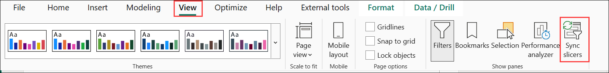

1. In the **Sync Slicers** pane (at the left of the **Visualizations** pane), in the second column (which represents syncing), check the checkboxes for the _Overview_ and _My Performance_ pages.

    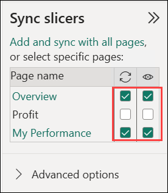

1. On the _Overview_ page, select the _Region_ slicer.

1. Sync the slicer with the _Overview_ and _Profit_ pages.

    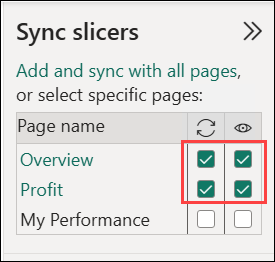

1. Test the sync slicers by selecting different filter options, and then verifying that the synced slicers filter by the same selection.

1. To close the **Sync Slicer** pane, select the **Sync Slicer** option located on the **View** ribbon tab.

## Exercise 2: Explore the Report

In this exercise you will explore the report that was published to Power BI.

### Task 1: Publish the report

In this task you will publish the report.

1. Select the **Overview** page.

2. Save the Power BI Desktop file.

3. On the **Home** ribbon tab, from inside the **Share** group, click **Publish**.

	.png)

4. In the **Publish to Power** BI window, notice that **My Workspace (1)** is selected.

5. To publish the report, click **Select (2)**.

	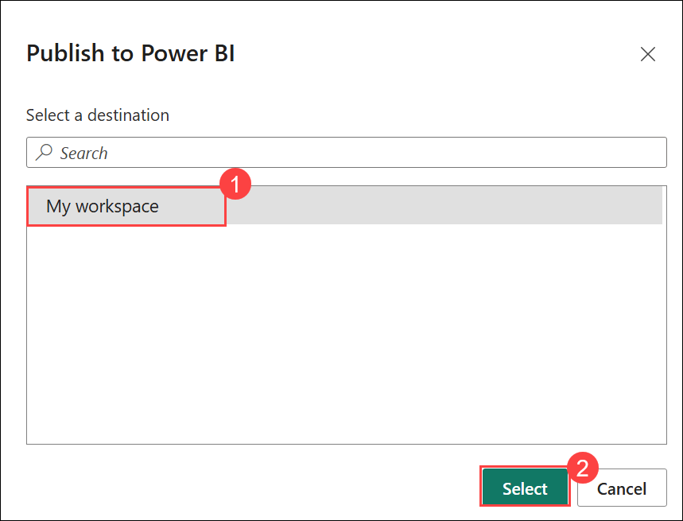

6. When the publication has succeeded, click **Got It**.

	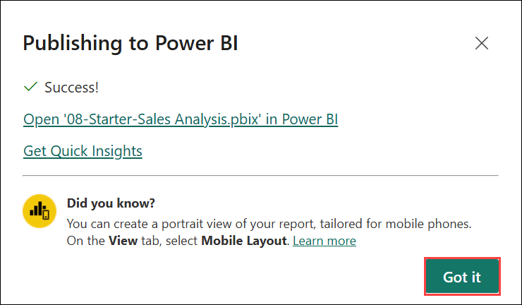

7. Leave Power BI Desktop open.

	>**Note:** You’ll explore the report in the Power BI service in the next exercise.

### Task 2: Explore the report

In this task you will explore the report that was published to Power BI.

1. In the Microsoft Edge browser window, in the Power BI service, in the **Navigation** pane (located at the left, and it could be collapsed), Select **My Workspace (1)**.

2. Review the contents of the workspace, noticing the **08-Starter-Sales Analysis (2)** report and Semantic models.

	>**Note:** When you published the Power BI Desktop file, the data model was published as a Semantic models.

	>**Note:** If you don’t see it, press **F5** to reload the browser, and then expand the workspace again.

	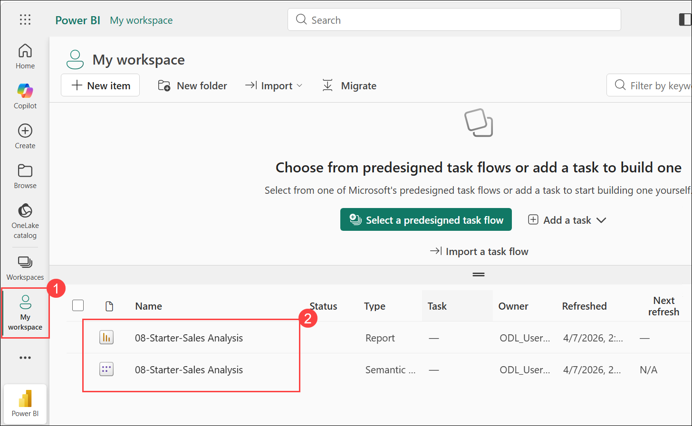

3. To explore the report, select the **08-Starter-Sales Analysis** report.

4. At the left, in the **Pages** pane, select the **Overview** page. 

5. In the **Regions** slicer, while pressing the **Ctrl** key, select multiple regions.

6. In the column/line chart, select any month column to cross filter the page.

7. While pressing the **Ctrl** key, select an additional month.

	>**Note**: By default, cross filtering filters all other visuals on the page.

8. Notice that the bar chart is filtered and highlighted, with the bold portion of the bars representing the filtered months.

9. Hover the cursor over the bar chart visual, and then at the top-right, hover the cursor over the filter icon.

	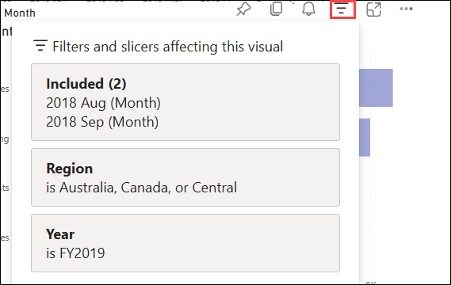

	>**Note**: The filter icon allows you to understand all filters that are applied to the visual, including slicers and cross filters from other visual.

10. Hover the cursor over a bar, and then notice the tooltip information.

11. To undo the cross filter, in the column/line chart, click an empty area of the visual.

12. Hover the cursor over the Stacked column visual, and then at the top-right, click the **Focus mode** icon.

	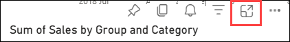

	>**Note**: Focus mode zooms the visual to full page size.

13. Hover the cursor over different segments of the bar charts to reveal tooltips.

14. To return to the report page, at the top-left, click **Back to Report**.

	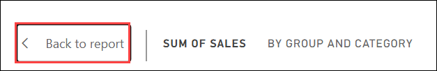

15. Hover the cursor over one of the visuals again, then at the top-right, select the ellipsis (…), and then notice the menu options. Try out each of the options, except the ones within **Share**.

	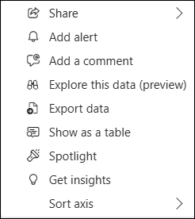

16. At the left, in the **Pages** pane, select the **Profit** page.

	.png)

17. Notice that the **Region** slicer has the same selection as made on the **Overview** page, thanks to synced slicers.

18. In the **Filters** pane (located at the right), expand a filter card, and apply some filters.

	>**Note**: The **Filters** pane allows you to define more filters than could possibly fit on a page as slicers.

19. In the matrix visual, use the plus (+) button to drill into the **Fiscal** hierarchy.

20. Select the **My Performance** page.

	.png)

21. At the top-right on the menu bar, click **View (1)**, and then select **Full Screen (2)**.

	

22. Interact with the page by modifying the slicer, and cross filtering the page.

23. At the bottom of the window, notice the commands to change page, navigate backwards or forwards between pages, or to exit full screen mode.

24. Click the left icon to exit full screen mode.

    .png)

## Review
 In this lab, you have completed the following :
- Get started – Sign in
- Enable Map and filled map visuals
- Design page 1,2 and 3
- Publish and explore the Report

## You have successfully completed the lab

