# Lab 06: Use DAX time intelligence functions in Power BI

## Lab story

In this lab, you'll create measures with DAX expressions that involve time intelligence.

In this lab, learn how to:

 - Use various time intelligence functions to manipulate filter context that specific concerns dates.

## Lab objectives

In this lab, you will perform:

- Get started
- Create a YTD measure
- Create a YoY growth measure

## Estimated timing: 30 Minutes   

## Task 1: Get started

In this task, you will open the provided starter Power BI (.pbix) file and prepare the environment for building time intelligence measures.

1. Open **File Explorer** on your machine.

2. Navigate to the following path:

   ```
   C:\PL300\PL-300-Microsoft-Power-BI-Data-Analyst-Main\Allfiles\Labs\06-use-dax-time-intelligence
   ```
3. Locate the file named: **06-Starter-Sales Analysis.pbix**
	
4. Double-click the file to open it in **Power BI Desktop**.

    > **Note:** You may see a sign-in dialog as the file loads. Select **Cancel** to dismiss the sign-in dialog. Close any other informational windows. Select **Apply Later**, if prompted to apply changes.

## Task 2: Create a YTD measure

In this task, you will create a Year-to-Date (YTD) measure using DAX to calculate cumulative sales based on the fiscal year.

1. In Power BI Desktop, in **Report view**, on **Page 2**, notice the matrix visual that displays various measures with years and months grouped on the rows.

    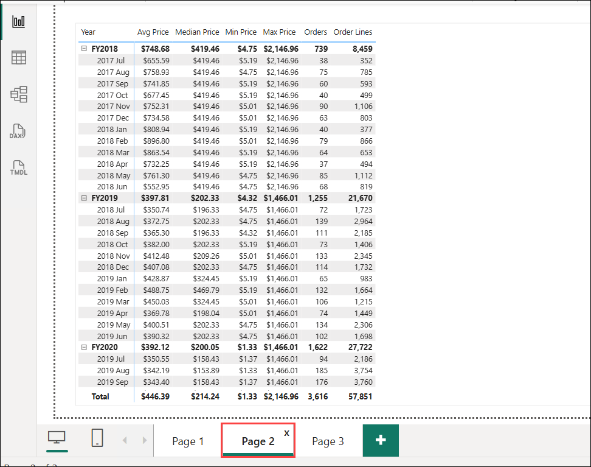

1. In the **Data** pane, right-click **Sales (1)**, and then select **New measure (2)**.

    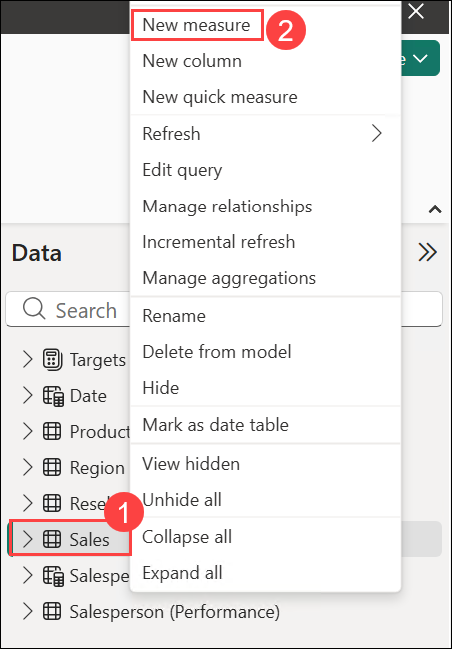

2. Add a measure to the `Sales` table, based on the following expression, and formatted to zero decimal places and press **Enter**:

    ```dax
    Sales YTD =
    TOTALYTD(
        SUM(Sales[Sales]),
        'Date'[Date],
        "6-30"
    )
    ```

    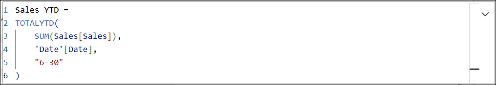

    > **Note:** The `TOTALYTD` function evaluates an expression—in this case the sum of the `Sales` column—over a given date column. The date column must belong to a date table marked as a date table.
    
    > **Note** The function can also take a third optional argument representing the last date of a year. The absence of this date means that December 31 is the last date of the year. For Adventure Works, June is in the last month of their year, and so "6-30" is used.

1. Select the **matrix visual**, then drag `Sales` and `Sales YTD` measure to the matrix visual.

    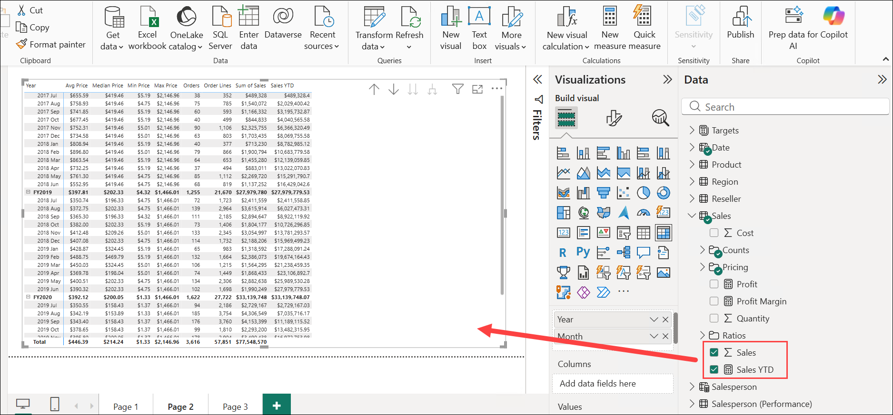

4. Notice the accumulation of sales values within the year.

    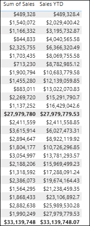

    > **Note:** The `TOTALYTD` function performs filter manipulation, specifically time filter manipulation. For example, to compute YTD sales for September 2017 (the third month of the fiscal year), all filters on the `Date` table are removed and replaced with a new filter of dates commencing at the beginning of the year (July 1, 2017) and extending through to the last date of the in-context date period (September 30, 2017).
    
    > **Note:** Many [time intelligence functions](/dax/time-intelligence-functions-dax/?azure-portal=true) are available in DAX to support common time filter manipulations._

## Task 3: Create a YoY growth measure

In this task, you will build a Year-over-Year (YoY) growth measure using variables and time intelligence functions to compare sales across years.

> Variables help you simplify the formula and are more efficient if using the logic multiple times within a formula. Variables are declared with a unique name, and the measure expression must then be output after the `RETURN` keyword. Unlike some other coding language variables, DAX variables can only be used within the single formula._

1. In the **Data** pane, right-click **Sales (1)**, and then select **New measure (2)**.

    

1. Enter the **Sales YoY Growth** formula and press **Enter**

    ```dax
    Sales YoY Growth =
    VAR SalesPriorYear =
        CALCULATE(
            SUM(Sales[Sales]),
            PARALLELPERIOD(
                'Date'[Date],
                -12,
                MONTH
            )
        )
    RETURN
        SalesPriorYear
    ```

    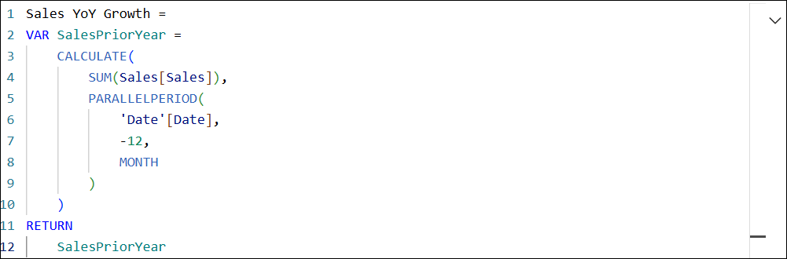

    > **Note:** The `SalesPriorYear` variable is assigned an expression that calculates the sum of the `Sales` column in a modified context. That context uses the `PARALLELPERIOD` function to shift 12 months back from each date in filter context.

1. Select the **matrix visual**, then drag `Sales YoY Growth` measure to the matrix visual.

    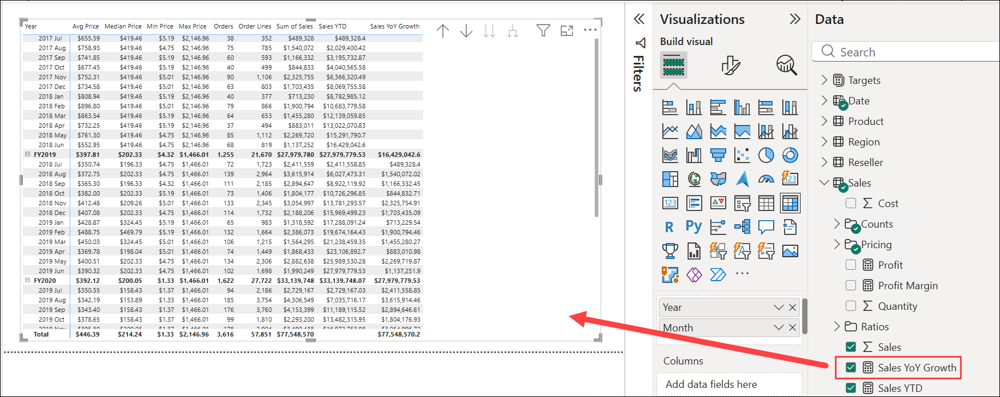

1. Notice that the new measure returns `BLANK` for the first 12 months (because there were no sales recorded before fiscal year 2017).

1. Notice that the `Sales YoY Growth` measure value for _2018 Jul_ is the sales value for _2017 Jul_.

    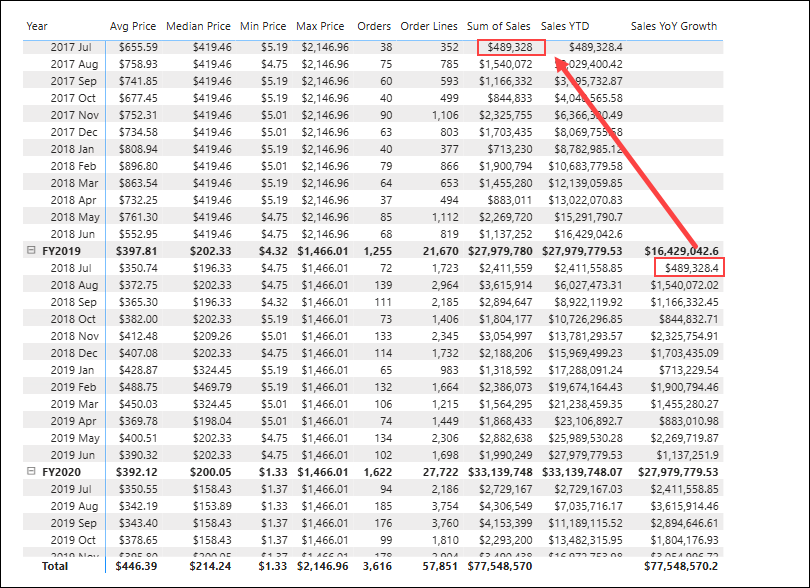

    > **Note** Now that the "difficult part" of the formula has been tested, you can overwrite the measure with the final formula that computes the growth result.

1. In the **Data** pane, select **Sales YoY Growth (1)**, enter the required formula in the formula bar **(2)**, and then press **Enter (3)**

    ```dax
    Sales YoY Growth =
    VAR SalesPriorYear =
        CALCULATE(
            SUM(Sales[Sales]),
            PARALLELPERIOD(
                'Date'[Date],
                -12,
                MONTH
            )
        )
    RETURN
        DIVIDE(
            (SUM(Sales[Sales]) - SalesPriorYear),
            SalesPriorYear
        )
    ```

    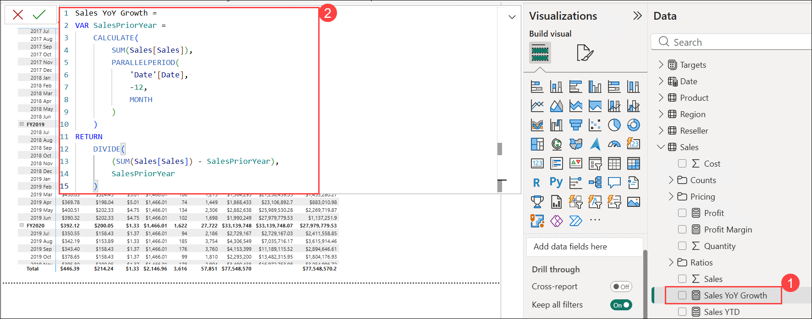

1. On the **Measure tools** ribbon, set **Format** to **Percentage (1)** and configure it to display two decimal places.

    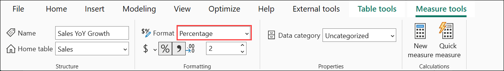

1. In the formula, in the `RETURN` clause, notice that the variable is referenced twice.

1. Verify that the YoY growth for _2018 Jul_ is 392.83 percent.

    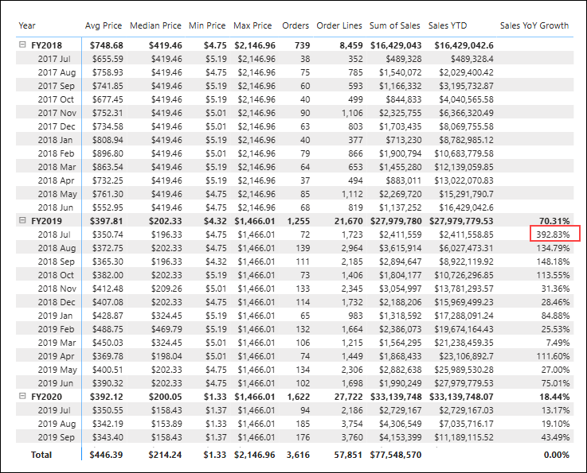

    > **Note** The YoY growth measure identifies almost 400 percent (or 4x) increase of sales during the same period of the previous year.

1. In Power BI Desktop, at the left, switch to **Model** view.

    

1. In the **Data** pane, expand **Sales**.

    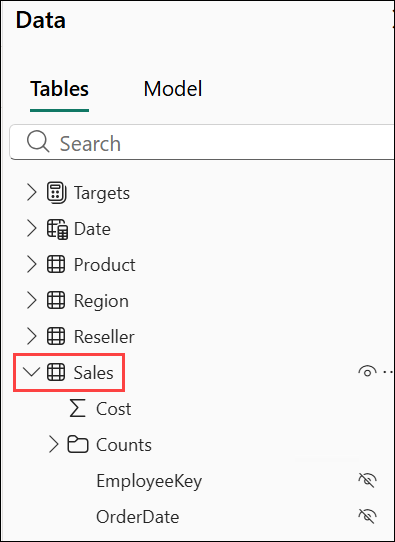

1. In the **Data** pane, select **Sales YoY Growth (1)** and **Sales YTD (1)** using Ctrl + click, and then enter **Time intelligence (2)** in the **Display folder** field.

    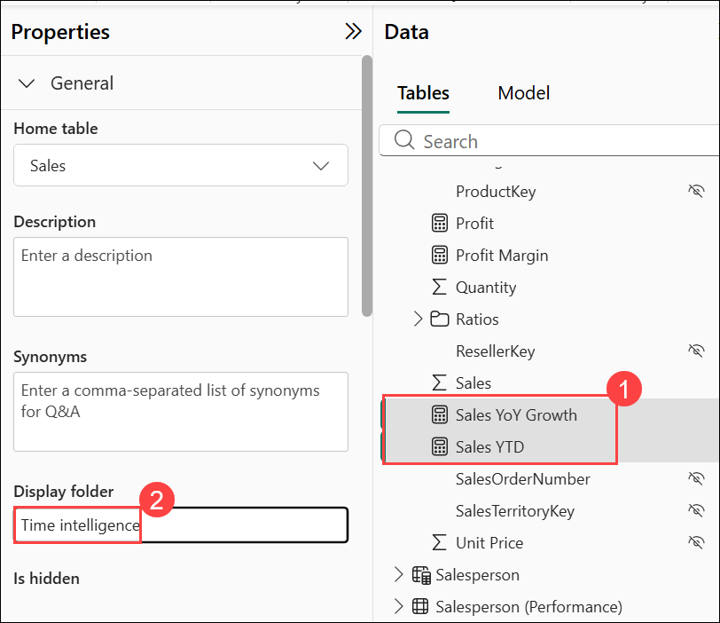

1. In the **Data** pane, verify that **Sales YoY Growth** and **Sales YTD** are grouped under the **Time intelligence** folder.

    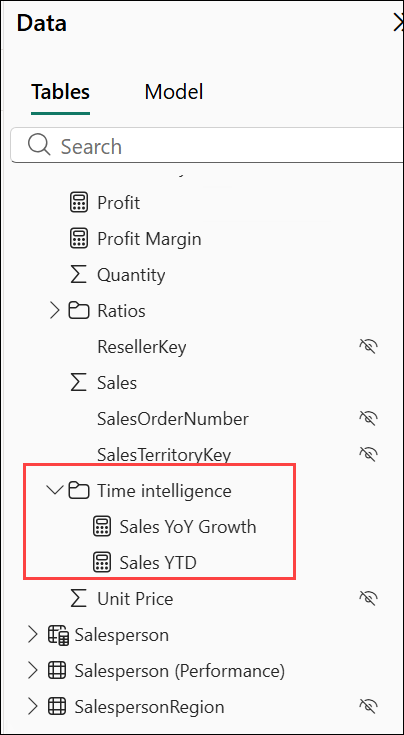

1. On the toolbar, select **Save (1)** to save the Power BI Desktop file.

     

### Review
 In this lab, you have completed the following :
- Opened the starter Power BI report
- Created a Year-to-Date (YTD) measure using DAX
- Created a Year-over-Year (YoY) growth measure using time intelligence function

## You have successfully completed the lab