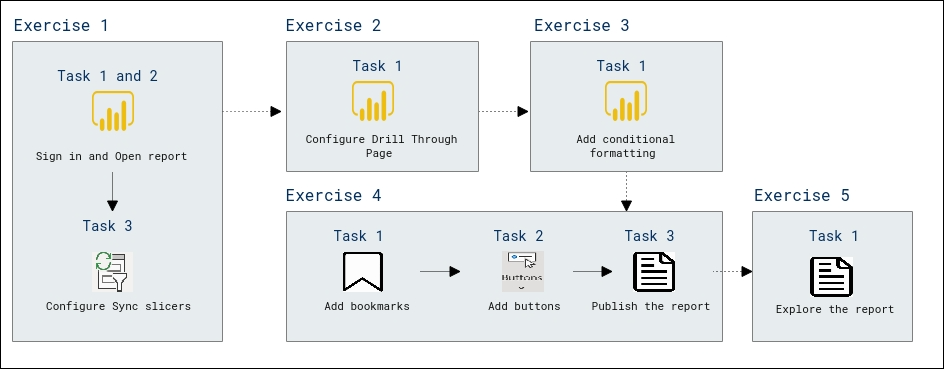
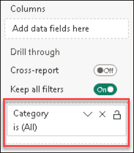
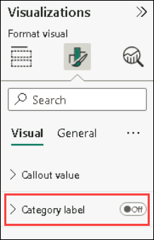
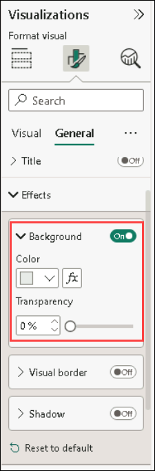
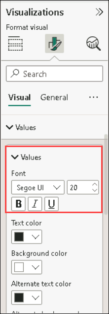
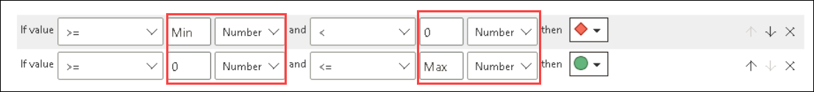
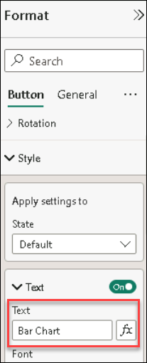
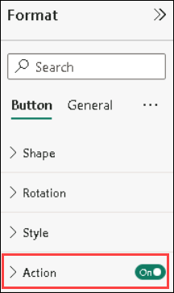
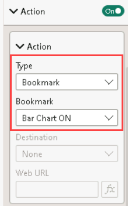

# Lab 09: Enhance Power BI report design

## Lab scenario
In this lab you will enhance the **Sales Analysis** with advanced design features.

In this lab, you learn how to:

- Create a drill through page.
- Apply conditional formatting.
- Create and use bookmarks and buttons.

## Lab objectives
In this lab, you will perform:

- Create a drill through page
- Apply conditional formatting
- Create and use bookmarks

## Estimated timing: 60 minutes    

## Architecture Diagram

 


### Task 1: Get started – Sign in

In this task you will setup the environment for the lab by signing in to Power BI.

1. To open Microsoft Edge, on the taskbar, click the Microsoft Edge.

 	

1. In the Microsoft Edge browser window, navigate to **https://powerbi.microsoft.com**.

 	**Tip:** You can also use the Power BI Service favorite on the Microsoft Edge favorites bar.

1. Click **Sign In** (located at the top-right corner).

 	

1. Enter the account details 

   - In the **Email (1)** field, enter your email address, and then select **Submit (2)**.

     * Azure Username/Email: <inject key="AzureAdUserEmail"></inject> 

	 	

   - Enter the Temporary Access Pass, and then select **Sign in**.
   
     * Azure Password: <inject key="AzureAdUserPassword"></inject>

	 	
 
1. If prompted to update the password, reenter the provided password, and then enter and confirm a new password.

 	**Important**: Be sure to record your new password.

1. Complete the sign in process by clicking on **Continue**

   
   
1. Enter a job title and 10 digit phone number and select Get started. Select Get started once more. You will be redirected to Power BI.
   
   
   
   

1. If prompted by Microsoft Edge to stay signed in, click **No**.

1. Leave the Microsoft Edge browser window open.

1. In the Microsoft Edge browser window, in the Power BI service, in the **Navigation** pane, select **My Workspace**.

 	

1. Leave the Microsoft Edge browser window open.

### Task 1: Get started with Power BI Desktop

In this task, you start by opening a starter Power BI file (.pbix). The starter file doesn't contain any data, but has been specially configured to help you complete the lab. The following report-level settings have been disabled in the starter file:

### Open the Starter Power BI File

To begin the exercise, follow these steps:

1. Open **File Explorer** on your machine.

2. Navigate to the following path:

   ```
   C:\PL300\PL-300-Microsoft-Power-BI-Data-Analyst-Main\Allfiles\Labs\07-create-visual-calculations
   ```
3. Locate the file named: **07-Starter-Sales Analysis.pbix**

	
	
4. Double-click the file to open it in **Power BI Desktop**.

> _**Note**: You may see a sign-in dialog as the file loads. Select **Cancel** to dismiss the sign-in dialog. Close any other informational windows. Select **Apply Later**, if prompted to apply changes._


## Exercise 2: Configure Drill Through

In this exercise you will create a new page and configure it as a drill through page. When you’ve completed the design, the page will look like the following:

.png)

### Task 1: Configure a drillthrough page

In this task you will create a new page and configure it as a drill through page.

1. Add a new report page named **Product Details**.

	.png)

2. Right-click the **Product Details** page tab, and then select **Hide Page**.

	.png)

	>**Note**: Report users won’t be able to go to the drill through page directly. They’ll need to access it from visuals on other pages. You’ll learn how to drill through to the page in the final exercise of this lab.

3. Beneath the **Visualizations** pane, in the **Drill Through** section, add the **Product \| Category** field to the **Add Drill-Through Fields Here** box.

	>**Note**: The labs use a shorthand notation to reference a field. It will look like this: **Product \| Category**. In this example, **Product** is the table name and **Category** is the field name.

	

4. To test the drill through page, in the drill through filter card, select **Bikes**.

	.png)

5. At the top-left of the report page, notice the arrow button.

	.png)

	>**Note**: A button is added automatically when a field is added to the drill through well/area. It allows report users to navigate back to the page from which they drilled through.

6. Add a **Card** visual to the page, and then resize and position it so it sits to the right of the button and fills the remaining width of the page.

	.png)

	

7. Drag the **Product \| Category** field into the card visual.

8. Configure the format options for the visual, and then turn the **Category Label** property to **Off**.

	

9. Set the **Effects > Background color** property to a light shade of gray such as **White, 20% darker**.

	

10. Add a **Table** visual to the page, and then resize and position it so it sits beneath the card visual and fills the remaining space on the page.

	.png)

	

11. Add the following fields to the visual:

	- Product \| Subcategory

	- Product \| Color

	- Sales \| Quantity

	- Sales \| Sales

	- Sales \| Profit Margin

	

12. Configure the format options for the visual, and in the **Values** section, set the **Text Size** property to **20pt**.

    

	>**Note**: The design of the drill through page is almost complete. You’ll enhance the page with conditional formatting in the next exercise.

## Exercise 3: Add Conditional Formatting

In this exercise you will enhance the drill through page with conditional formatting. When you’ve completed the design, the page will look like the following:

.png)

### Task 1: Add conditional formatting

In this task you will enhance the drill through page with conditional formatting.

1. Select the table visual.

2. In the visualization pane, click the down-arrow on the **Profit Margin** value, and then select **Conditional Formatting \| Icons**.

	.png)

3. In the **Icons – Profit Margin** window, in the **Icon Layout** dropdown list, select **Right of Data**.

	.png)

4. To delete the middle rule, at the right of the yellow triangle, select **X**.

	.png)

5. Configure the first rule (red diamond) as follows:

	- In the second control, remove the value

	- In the third control, select **Number**

	- In the fifth control, enter **0**

	- In the sixth control, select **Number**

6. Configure the second rule (green circle) as follows:

	- In the second control, enter **0**

	- In the third control, select **Number**

	- In the fifth control, remove the value

	- In the sixth control, select **Number**

	

	>**Note**: The rules can be interpreted as follows: display a red diamond if the profit margin value is less than 0; otherwise if the value is great or equal to zero, display a green circle.

7. Click **OK**.

	.png)

8. In the table visual, verify that the that the correct icons are displayed.

	.png)

9. Configure background color conditional formatting for the **Color** field.

10. In the **Background Color – Color** window, in the **Format Style** dropdown list, select **Field Value**.

11. In the **What field should we base this on?** dropdown list, select **Product \| Formatting \| Background Color Format**.

	.png)

12. Click **OK**.

	.png)

13. Repeat the previous steps to configure font color conditional formatting for the **Color** field, using the **Product \| Formatting \| Font Color Format** field

	>**Note**: You may recall that the background and font colors were source from the **ColorFormats.csv** file in the **Prepare Data in Power BI Desktop** lab, and then integrated with the **Product** query in the **Load Data in Power BI Desktop** lab.

## Exercise 4: Add Bookmarks and Buttons

In this exercise you will enhance the **My Performance** page with buttons, allowing the report user to select the visual type to display. When you’ve completed the design, the page will look like the following:

.png)

### Task 1: Add bookmarks

In this task you will add two bookmarks, one to display each of the monthly sales/targets visuals.

1. Go to the **My Performance** page.

2. On the **View** ribbon tab, from inside the **Show Panes** group, click **Bookmarks**.

	.png)

3. On the **View** ribbon tab, from inside the **Show Panes** group, click **Selection**.

	.png)

4. In the **Selection** pane, beside one of the **Sales and Target by Month** items, to hide the visual, click the eye icon.

	.png)

5. In the **Bookmarks** pane, click **Add**.

	.png)

6. To rename the bookmark, double-click the bookmark.

7. If the visible chart is the bar chart, rename the bookmark as **Bar Chart ON** .

8. To edit the bookmark, in the **Bookmarks** pane, hover the cursor over the bookmark, click the ellipsis, and then select **Data**.

	

	>**Note**: Disabling the **Data** option means the bookmark won’t use the current filter state. That’s important because otherwise the bookmark would permanently lock in the filter currently applied by the **Year** slicer.

9. To update the bookmark, click the ellipsis again, and then select **Update**.

	.png)

	>**Note**: In the following steps, you’ll create and configure a second bookmark to show the second visual.

10. In the **Selection** pane, toggle the visibility of the two **Sales and Target by Month** items.

	>**Note**: In other words, make the visible visual hidden, and make the hidden visual visible.

	.png)

11. Create a second bookmark, and name it as **Column Chart ON**

	.png)

12. Configure the second bookmark to ignore filters (**Data** option off), and update the bookmark.

13. In the **Selection** pane, to make both visuals visible, simply show the hidden visual.

14. Resize and reposition both visuals so they fill the page beneath the multi-card visual, and completely overlap one another.

	**Tip**: To select the visual that is covered up, select it in the **Selection** pane.

	

15. In the **Bookmarks** pane, select each of the bookmarks, and notice that only one of the visuals is visible.

	>**Note**: The next stage of design is to add two buttons to the page, which will allow the report user to select the bookmarks.

### Task 2: Add buttons

In this task you will add two buttons, and assign bookmark actions to each.

1. On the **Insert** ribbon, from inside the **Elements** group, click **Button**, and then select **Blank**.

	.png)

2. Position the button directly beneath the **Year** slicer.

3. In the **Format button** pane, select **Button** expand **Style** section and turn the **Text** property to **On**. Then in the **Text** box, enter **Bar Chart**.

	

4. Expand the **Fill** section, and then set a fill color using a complementary color.

5. Expand **Action** section and turn the **Action** property to **On**.

	

6. Expand the **Action** section, and then set the **Type** dropdown list to **Bookmark**. In the **Bookmark** dropdown list, select **Bar Chart ON**.

	

7. Create a copy of the button by using copy and paste, and then configure the new button as follows:

	**Tip:** The shortcut commands for copy and paste are **Ctrl+C** followed by **Ctrl+V**.

	- Set the **Button Text** property to **Column Chart**

	- In the **Action** section, set the **Bookmark** dropdown list to **Column Chart ON**

	>**Note**: The design of the Sales Analysis report is now complete.

### Task 3: Publish the report

In this task you will publish the report.

1. Select the **Overview** page.

2. In the **Year** slicer, select **FY2020**.

3. In the **Region** slicer, select **Select All**.

4. Save the Power BI Desktop file.

	>**Note**: The file must always be saved prior to publishing to the Power BI service.

5. On the **Home** ribbon tab, from inside the **Share** group, click **Publish**.

	.png)

6. In the **Publish to Power** BI window, notice that **My Workspace** is selected.

7. To publish the report, click **Select**.

	.png)

8. If prompted to replace the dataset, click **Replace**.

9. When the publication has succeeded, click **Got It**.

	.png)

10. Close Power BI Desktop.

	>**Note**: You’ll explore the report in the Power BI service in the next exercise.

## Exercise 5: Explore the Report

In this exercise you will explore the report in the Power BI service.

### Task 1: Explore the report

In this task you will explore the report in the Power BI service.

1. In the Microsoft Edge browser window, in the Power BI service, in the **Navigation** pane, select **My Workspace** and then click the **Sales Analysis** report.

2. To test the drill through report, in the **Overview** page, in the **Quantity by Category** visual, right-click the **Clothing** bar, and then select **Drill Through \| Product Details**.

	.png)

3. Notice that the **Product Details** page is for **Clothing**.

4. To return to the source page, at the top-left corner of the page, click the arrow button.

5. Select the **My Performance** page.

6. Click each of the buttons, and then notice that a different visual is displayed.

## Review
In this lab, you have completed the following :

- Configure Drill Through
- Add Conditional Formatting
- Add Bookmarks and Buttons
- Explore the Report

## You have successfully completed the lab


