# Lab 10: Perform analytics in Power BI

## Lab scenario
In this lab you will create the **Sales Exploration** report.

In this lab you learn how to:

- Create animated scatter charts

- Use a visual to forecast values

## Lab objectives
In this lab, you will perform:

- Create animated scatter charts
- Use a visual to forecast values
  
## Estimated timing: 60 Minutes    

## Architecture Diagram

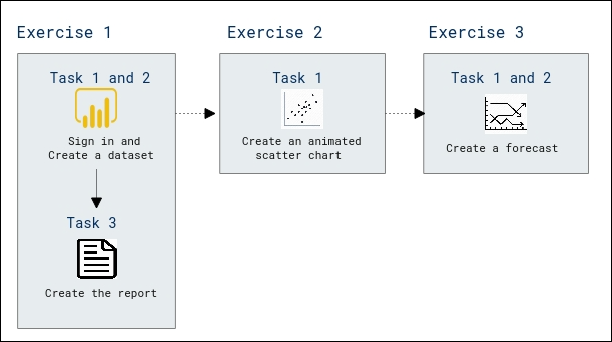
 
## Exercise 1: Create a Scatter Chart

In this exercise you will create a scatter chart that can be animated.

### Task 1: Get started – Open report

In this task you will setup the environment for the lab by opening the starter report.

1. Click the Microsoft **Power BI Desktop** shortcut icon to open.

 	

1. To open the starter Power BI Desktop file, click the **Open (1)** button at left panel and select **Browse this device (2)**.

	

1. In the **Open** window, navigate to the **C:\PL300\PL-300-Microsoft-Power-BI-Data-Analyst-Main\Allfiles\Labs\10-perform-analytics-power-bi (1)** folder. Select the **10-Starter-Sales Analysis (2)** file and click **Open (3)**.

   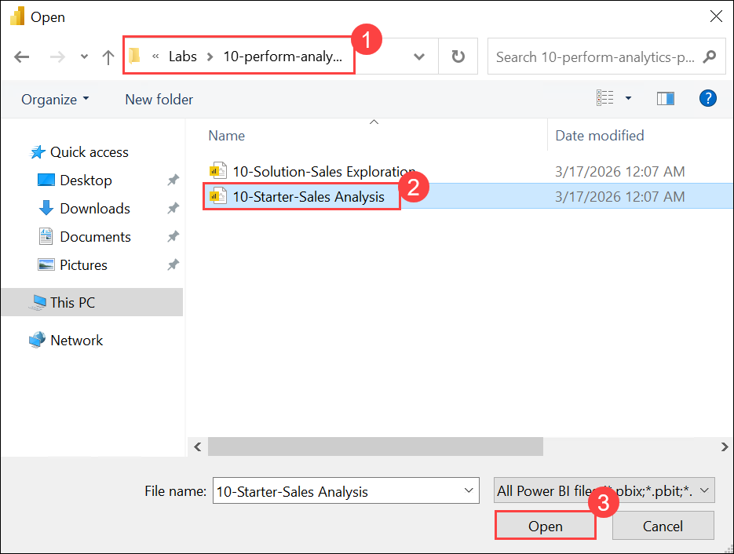

1. Close any informational windows that may open.

1. If prompted to apply changes, click **Apply Later**.

    

### Task 2: Create an animated scatter chart

In this task you will create a scatter chart that can be animated.

1. In Power BI Desktop, at the bottom-left, Click the **+ (plus icon)** to create new page.

	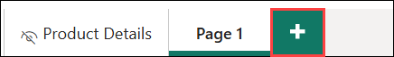

1. Right-click **Page 1**, and then select **Rename**.

	>**Tip:** You can also double-click the page name to rename it.

1. Rename the page as **Scatter Chart**, and then press **Enter**.

	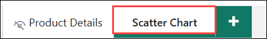

2. In the **Visualizations** pane, Add a **Scatter Chart** visual to the report page, and then position and resize it so it fills the entire page.

	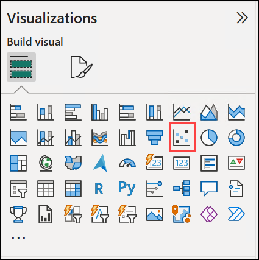

	

	> **Note:** The chart can be animated when a field is added to the **Play Axis** well/area.

1. In the **Data** pane, select **Sales \| Sales**, and then drag it to the **X Axis** field in the **Visualizations** pane.

	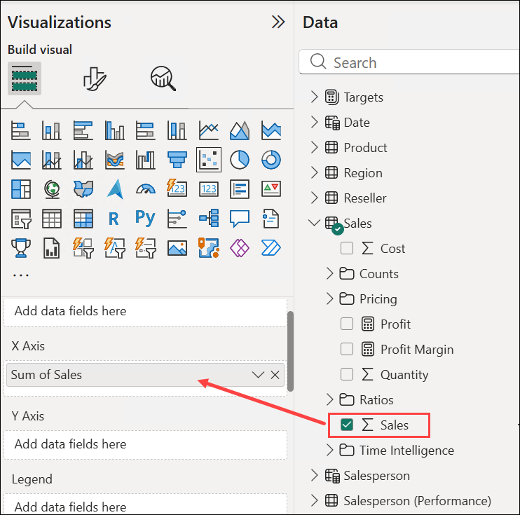

3. Add the following fields to the visual wells/areas:

	>**Note:** The labs use a shorthand notation to reference a field. It will look like this: **Reseller** **\|** **Business Type**. In this example, **Reseller** is the table name and **Business Type** is the field name.

	- Y Axis: **Sales \| Profit Margin**

	- Legend: **Reseller \| Business Type**

	- Size: **Sales \| Quantity**

	- Play Axis: **Date \| Quarter**

	  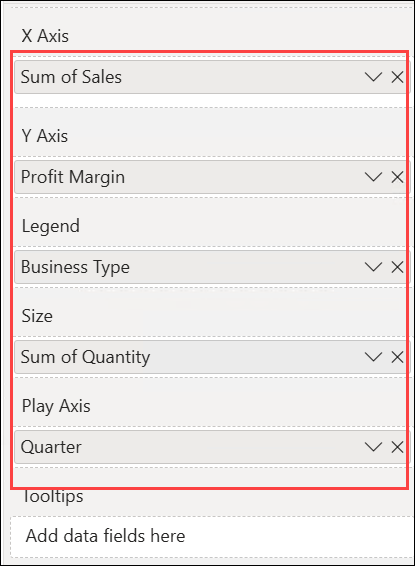

4. In the **Filters** pane, add the **Product \| Category** field to the **Filters On This Page** well/area.

	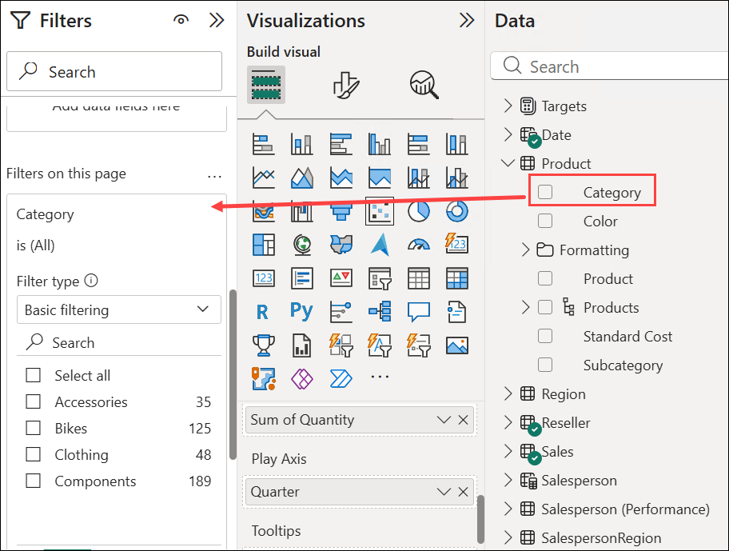

	 > **Note:** If the **Filters** pane is collapsed, select **>>** to expand it.

5. In the filter card, filter by **Bikes**.

	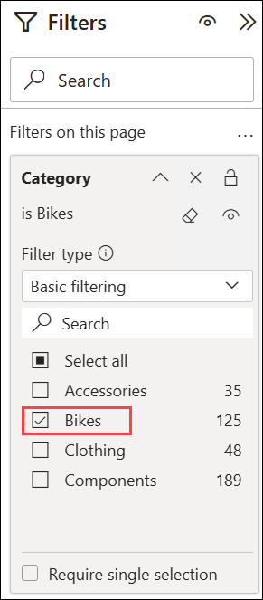

6. To animate the chart, at the bottom left corner, click **Play**.

	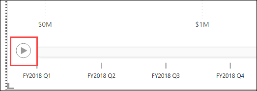

7. Watch the entire animation cycle from **FY2018 Q1** to **FY2020 Q4**.

	>**Note:** The scatter chart allows understanding the measure values simultaneously: in this case, order quantity, sales revenue, and profit margin.

	>**Note:** Each bubble represents a reseller business type. Changes in the bubble size reflect increased or decreased order quantities. While horizontal movements represent increases/decreases in sales revenue, and vertical movements represent increases/decreases in profitability.

8. When the animation stops, click one of the bubbles to reveal its tracking over time.

9. Hover the cursor over any bubble to reveal a tooltip describing the measure values for the reseller type at that point in time.

10. In the **Filters** pane, filter by **Clothing** only, and notice that it produces a very different result.

11. Save the Power BI Desktop file.

	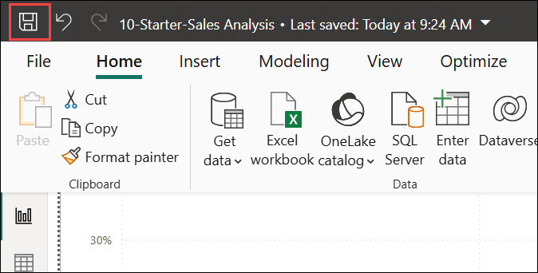

## Exercise 2: Create a Forecast

In this exercise you will create a forecast to determine possible future sales revenue.

### **Task 1: Create a forecast**

In this task you will create a forecast to determine possible future sales revenue.

1. Add a new page, and then rename the page to **Forecast**.

	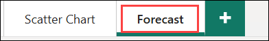

2. Add a **Line Chart** visual to the report page, and then position and resize it so it fills the entire page.

	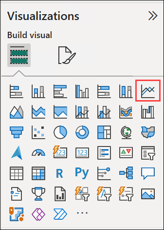

	

3. Add the following fields to the visual wells/areas:

	-X Axis: **Date | Date**

	-Y Axis: **Sales | Sales** 

	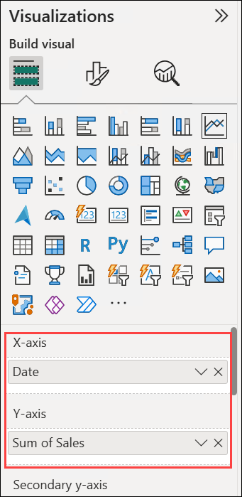

4. In the **Filters** pane, add the **Date \| Year** field to the **Filters On This Page** well/area.

5. In the filter card, filter by two years: **FY2019** and **FY2020**.

	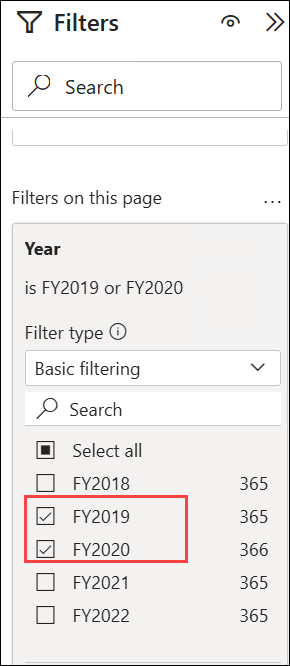

	>**Note:** When forecasting over a time line, you will need at least two cycles (years) of data to produce an accurate and stable forecast.

6. Add also the **Product \| Category** field to the **Filters On This Page** well/area, and filter by **Bikes**.

	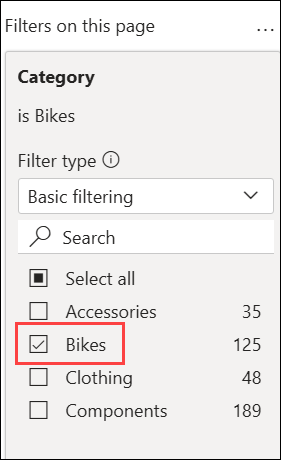

7. To add a forecast, beneath the **Visualizations** pane, select the **Analytics** pane.

	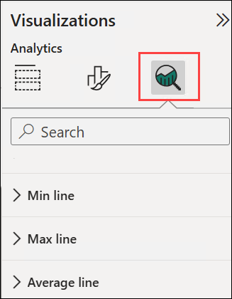

8. Expand the **Forecast** section.

    >**Note:** If the **Forecast** section is not available, it’s probably because the visual hasn’t been correctly configured. Forecasting is only available when two conditions are met: the axis has a single field of type date, and there’s only one value field.

9. Turn the **Forecast** option to **On**/ Click **Add**

	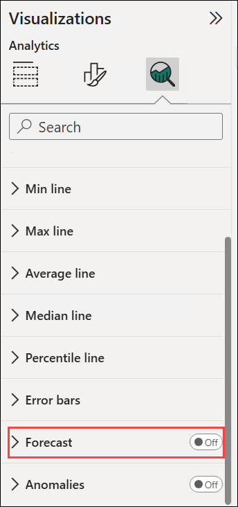

10. Configure the following forecast properties:
     
	 - Forecast length: 1 month **(1)**
     - Seasonality: 365 **(2)**
     - Confidence interval: 80% **(3)**

11. Click **Apply (4)**.

	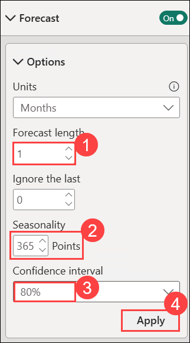

12. In the line visual, notice that the forecast has extended one month beyond the history data.

	>**Note:** The gray area represents the confidence. The wider the confidence, the less stable—and therefore the less accurate—the forecast is likely to be.

	>**Note:** When you know the length of the cycle, in this case annual, you should enter the seasonality points. Sometimes it could be weekly (7), or monthly (30).

13. In the **Filters** pane, filter by **Clothing** only, and notice that it produces a different result.

14. Save the Power BI Desktop file.

	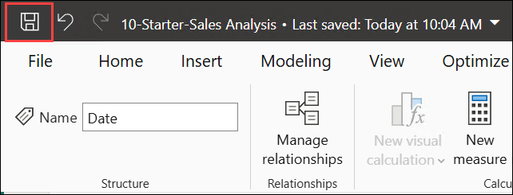

## Review

In this lab, you have completed the following :

- Created an animated scatter chart
- Created a forecast

## You have successfully completed the lab

 
