# Lab 12: Create a Power BI Dashboard

## Lab scenario
 
In this lab you will create the **Sales Monitoring** dashboard in the Power BI service using an existing report.

## Lab objectives

In this lab you learn how to:

- Pin visuals to a dashboard

- Use Q&A to create dashboard tiles

## Estimated timing: 60 Minutes    

## Architecture Diagram

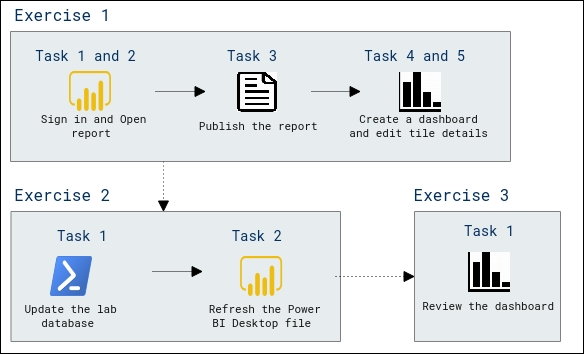   

## Exercise 1: Create a Dashboard

In this exercise, you will create the **Sales Monitoring** dashboard. The completed dashboard will look like the following:


## Pre-requisites

In this task, you will verify that the AdventureWorksDW2020 database is available.

1. In the search bar of your **LabVM**, enter **SQL Server Management Studio**, and then select **SQL Server Management Studio** to open it.

1. In the **Connect to Server** dialog, verify the **Server name**, and then select **Connect**.

    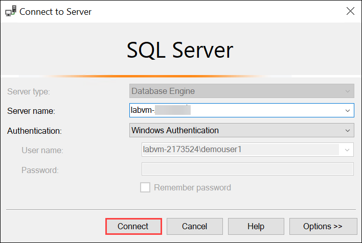

1. In **Object Explorer**, expand **Databases (1)** and verify that **AdventureWorksDW2020 (2)** is available.

    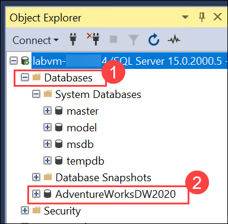

    > **Note:** If **AdventureWorksDW2020** is not available under **Databases**, follow the below steps to restore it; otherwise, skip the prerequisites and proceed to Task 1.

1. In **Object Explorer**, right click **Databases** folder on the **Object Explorer** window. Then select **Restore Database**.

    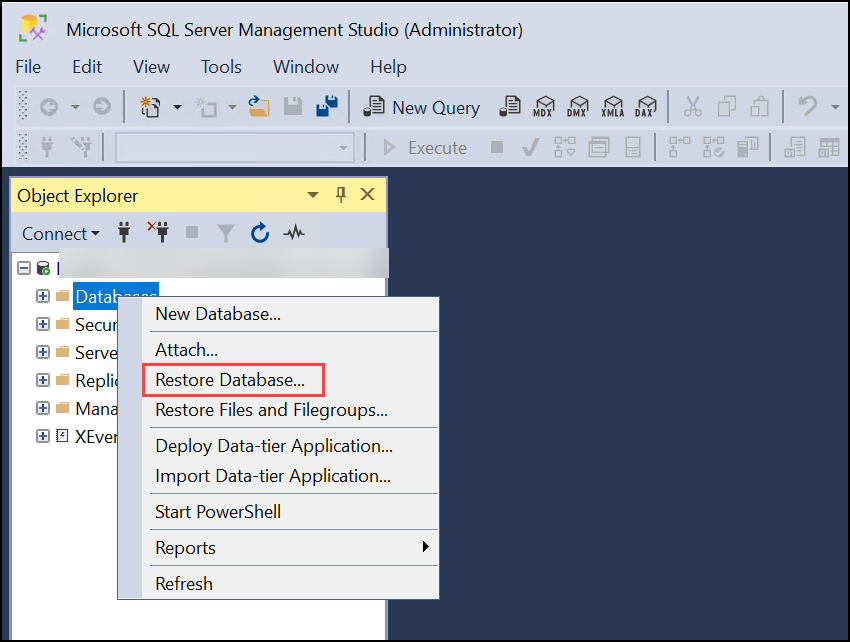

1. On the **Restore Database** window, select **Device (1)**, then click on the **Ellipsis(...) (2)** button.

    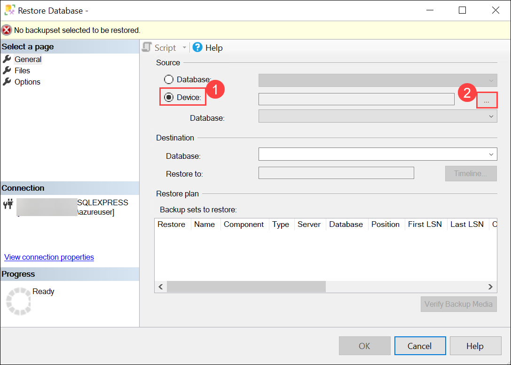

1. On **Select backup devices** window, select **Add**.

    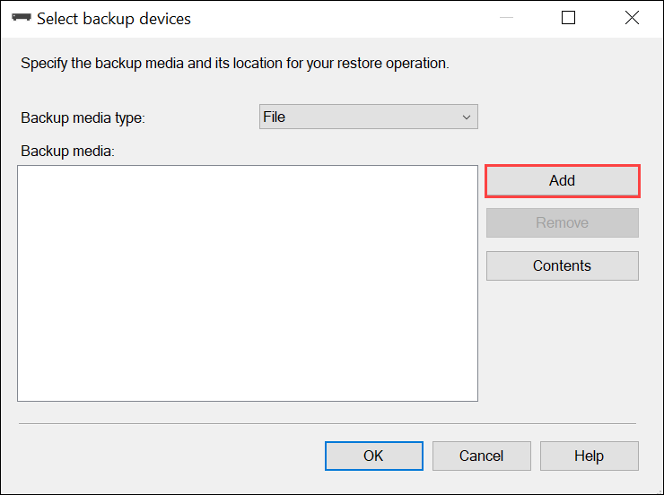

1. On **Locate backup file** window, select **C:\PL300\PL-300-Microsoft-Power-BI-Data-Analyst-Main\Allfiles\DatabaseBackup (1)**, then select **AdventureWorksDW2020.bak (2)** backup. Click **Ok (3)**.

    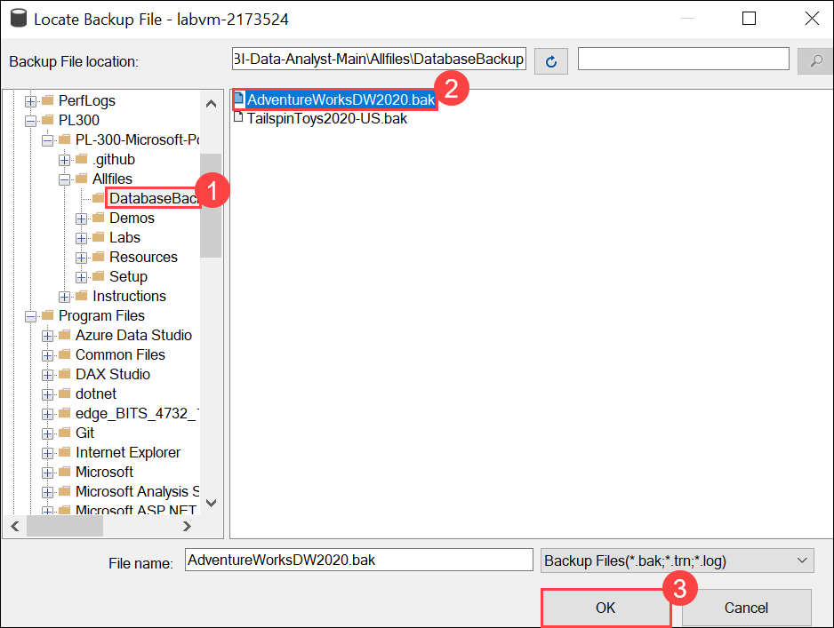

1. On **Select backup devices** window select **Ok**. And on the **Restore Database** window, select **Ok**.

    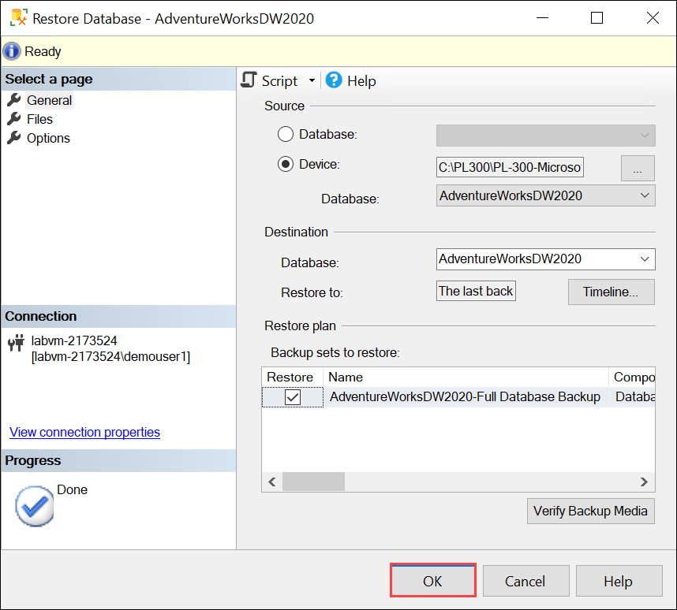

1. After a while you will get a window showing **Database Adventureworks 2020 restored successfully**. Click on **Ok**.

    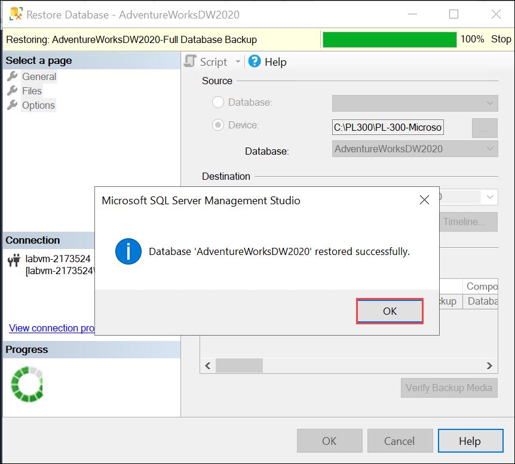

### Task 1: Get started – Sign in

In this task you will setup the environment for the lab by signing in to Power BI.

1. To open Microsoft Edge, on the taskbar, click the Microsoft Edge.

 	

1. In the Microsoft Edge browser window, navigate to **https://powerbi.microsoft.com**.

 	**Tip:** You can also use the Power BI Service favorite on the Microsoft Edge favorites bar.

1. Click **Sign In** (located at the top-right corner).

 	

1. Enter the account details 

   - In the **Email (1)** field, enter your email address, and then select **Submit (2)**.

     * Azure Username/Email: <inject key="AzureAdUserEmail"></inject> 

	 	

   - Enter the Temporary Access Pass, and then select **Sign in**.
   
     * Azure Password: <inject key="AzureAdUserPassword"></inject>

	 	
 
1. If prompted to update the password, reenter the provided password, and then enter and confirm a new password.

 	**Important**: Be sure to record your new password.

1. Complete the sign in process by clicking on **Continue**

   
   
1. Enter a job titel and 10 digit phone number and select Get started. Select Get started once more. You will be redirected to Power BI.
   
   
   
   

1. If prompted by Microsoft Edge to stay signed in, click **No**.

1. Leave the Microsoft Edge browser window open.

### Task 2: Get started – Open report

In this task you will setup the environment for the lab by opening the starter report.

1. Click the Microsoft **Power BI Desktop** shortcut icon to open.

 	

1. If Power BI Desktop is not signed in to the Power BI service, at the top-right, click **Sign In**.

    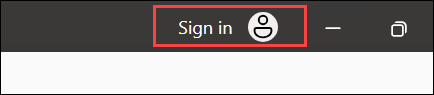

1. In the **Email** field, enter your email address, and then select **Continue**.

	 * Azure Username/Email: <inject key="AzureAdUserEmail"></inject> 

	  

1. Enter your email address, and then select **Next**. 

	

1. Enter the Temporary Access Pass, and then select **Sign in**.
   
     * Azure Password: <inject key="AzureAdUserPassword"></inject>

	   

1. On the **Sign in to all apps and websites on this device?** screen, select **No, this app only**.

	

1. To open the starter Power BI Desktop file, click the **Open (1)** button at left panel and select **Browse this device (2)**.

	

1. In the **Open** window, navigate to the **C:\PL300\PL-300-Microsoft-Power-BI-Data-Analyst-Main\Allfiles\Labs\12-create-power-bi-dashboard (1)** folder. Select the **12-Starter-Sales Analysis (2)** file and click **Open (3)**.

   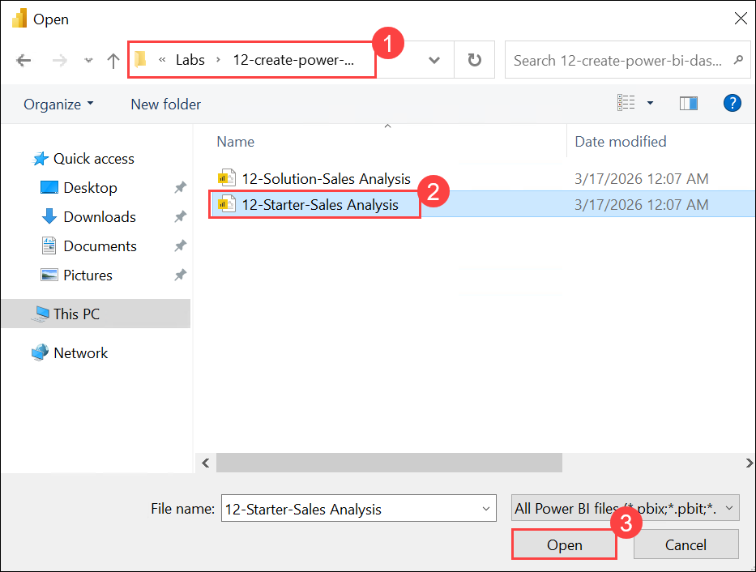

1. Close any informational windows that may open.

### Task 3: Get started – Publish the report

In this task you will setup the environment for the lab by creating a Semantic model.

1. In the Microsoft Edge browser window, in the Power BI service, navigate to **My Workspace (1)**.

1. Select **Import (2) > Report, Paginated Report or Workbook (3) > From this computer (4)**.

    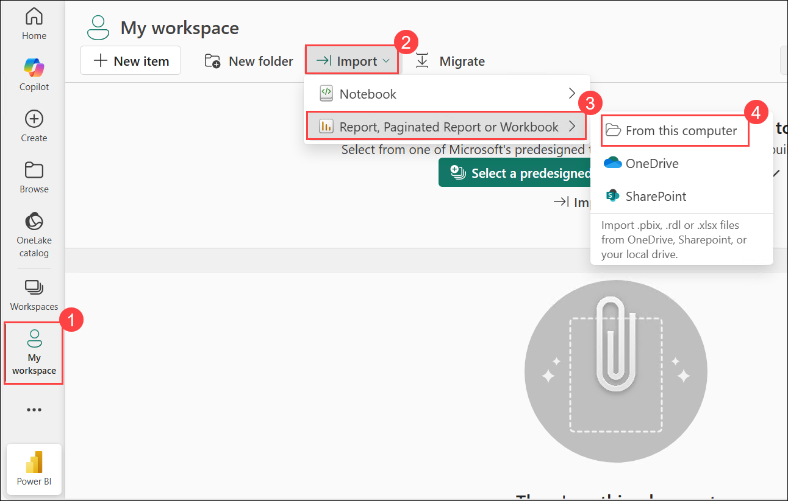

1. In the **Open** window, navigate to the **C:\PL300\PL-300-Microsoft-Power-BI-Data-Analyst-Main\Allfiles\Labs\12-create-power-bi-dashboard (1)** folder.

1. Select the **12-Starter-Sales Analysis (2)** file, and then click **Open (3)**.

    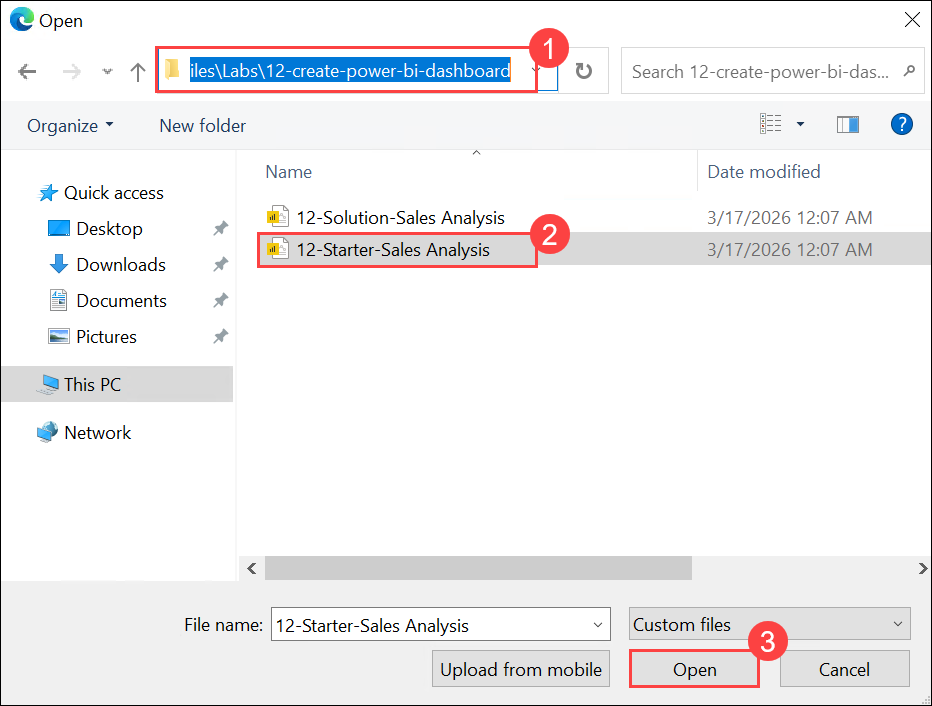

1. If prompted to replace the Semantic model, click **Replace it**.

### Task 4: Create a dashboard

In this task you will create the **Sales Monitoring** dashboard. You will pin a visual from the report, and add a tile based on an image data URI, and use Q&A to create a tile.

1. In the Microsoft Edge browser window, in the Power BI service, open the **12-Starter-Sales Analysis** report.

2. In the **Overview** page, set the **Year** slicer to **FY2020**.

    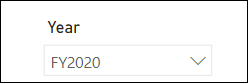

3. Set the **Region** slicer to **Select All**.

    >**Note:** When pinning visuals to a dashboard, they will use the current filter context. Once pinned, the filter context cannot be changed. For time-based filters, it’s a better idea to use a relative date slicer (or, Q&A using a relative time-based question).

4. To create a dashboard and pin a visual, hover the cursor over the **Sales and Profit Margin by Month** (column/line) visual, and select the **pushpin**.

    

5. In the **Pin to Dashboard** window, in the **Dashboard Name** box, enter **Sales Monitoring**, then select **Pin**.

    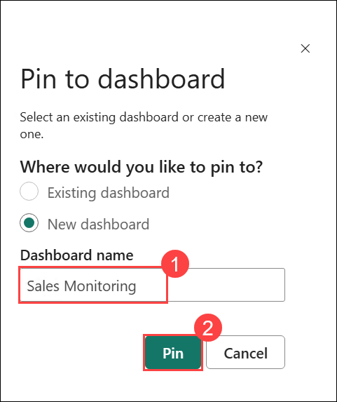

7. On the **Navigation** pane, select **My Workspace (1)** and then open the **Sales Monitoring (2)** dashboard.

    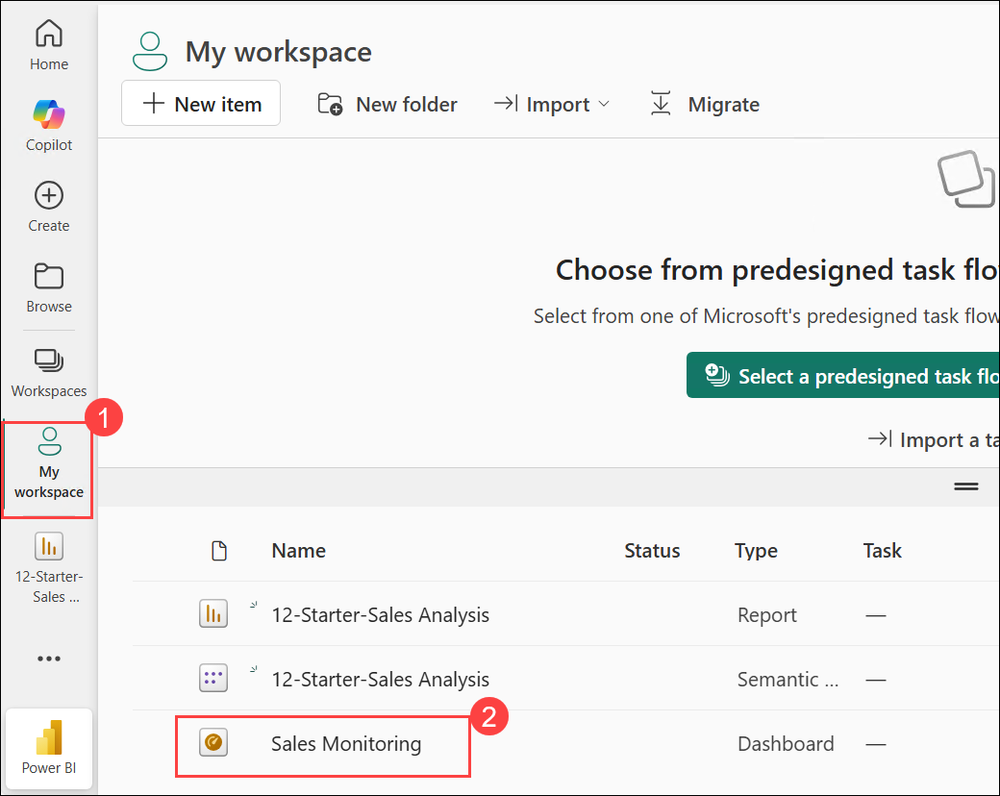

8. Notice that the dashboard has a single tile.

    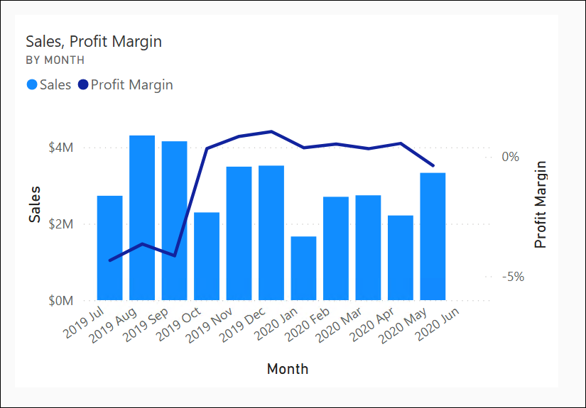

9. To add a tile based on a question, at the top-left of the dashboard, click **Ask a Question About Your Data**.

    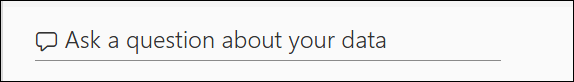

    > **Note:** You can use the Q&A feature to ask a question, and Power BI will respond will a visual.

10. Click any one of the suggested questions beneath the Q&A box, in the boxes.

11. Review the response.

12. Remove all text from the Q&A box.

13. In the Q&A box, enter the following: **Sales YTD**

    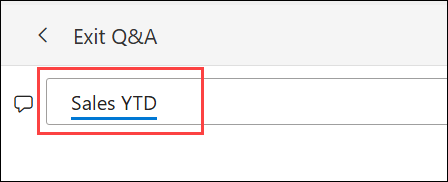

14. Notice the response of **(Blank)**.

    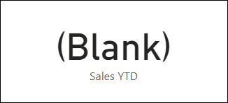

    > **Note:** You may recall you added the **Sales YTD** measure in the **Create DAX Calculations in Power BI Desktop** lab. This measure is a Time Intelligence expression and it so requires a filter on the **Date** table to produce a result.

15. Extend the question with: **in year FY2020**.

    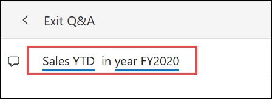

16. Notice the response is now **$33M**.

     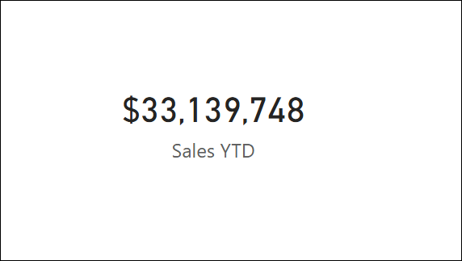

     > **Note:** You might get the different value in response.

17. To pin the response to the dashboard, at the top-right corner, click **Pin Visual**.

    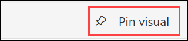

1. When prompted, select **Sales Monitoring (1)** from the drop-down menu, select **Pin (2)**.

    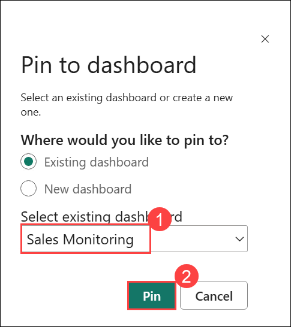

19. To return to the dashboard, at the top-left corner, click **Exit Q&amp;A**.

    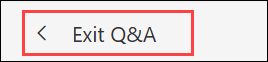

20. To add the company logo, on the menu bar, click **Edit (1)**, and then select **Add a Tile (2)**.

    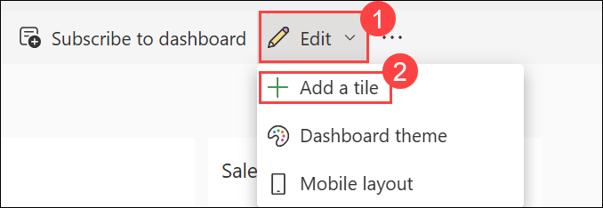

    >**Note:** Using this technique to add a dashboard tile lets you embellish your dashboard with media, including web content, images, richly-formatted text boxes, and video (using YouTube or Vimeo links).

21. In the **Add a Tile** pane (located at the right), select the **Image (1)** tile.

22. Click **Next (2)**.

     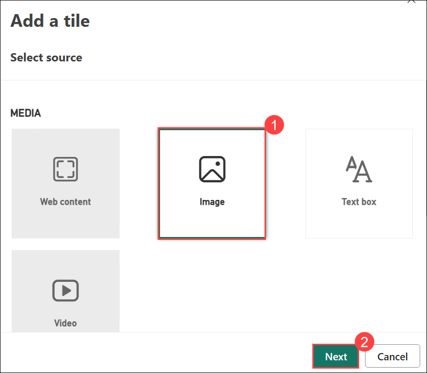

1. Open **File Explorer** on your machine.

2. Navigate to the following path:

   ```
   C:\PL300\PL-300-Microsoft-Power-BI-Data-Analyst-Main\Allfiles\Labs\12-create-power-bi-dashboard\AdventureWorksLogo_DataURL.txt
   ```
1. It will open in Notepad, Press **Ctrl + A → Ctrl + C** (Copy all content).

    >**Note**: You can embed an image by using its URL, or you can use a data URL, which embeds content inline.

24. In the **Add Image Tile** pane, in the **URL** box, paste in the URL from the text file **(1)**, and then **Apply (2)**.

    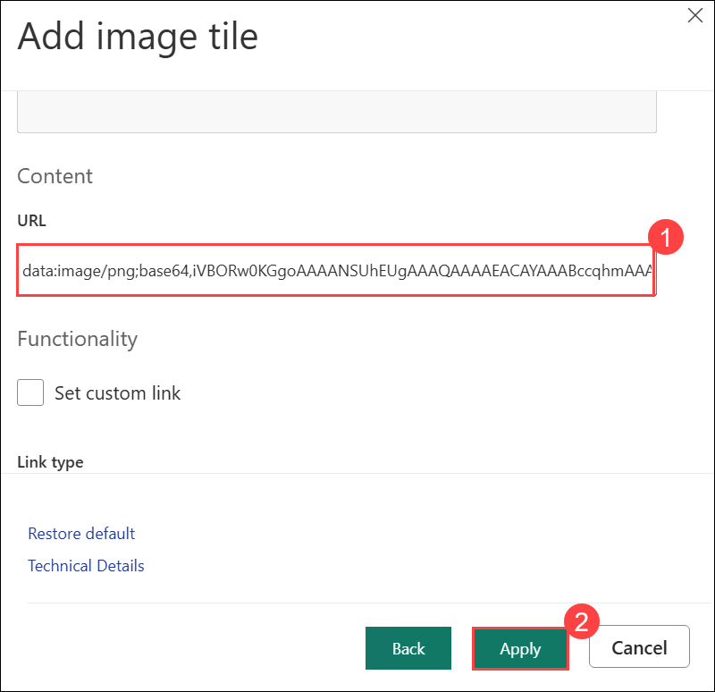

25. To resize the logo tile, drag the bottom-right corner, and resize the tile to become one unit wide, and two units high.

    >**Note**: Tile sizes are constrained into a rectangular shape. It’s only possible to resize into multiples of the rectangular shape.

26. Organize the tiles so that the logo appears at the top-left, with the **Sales YTD** tile beneath it, and the **Sales, Profit Margin** tile at the right.

    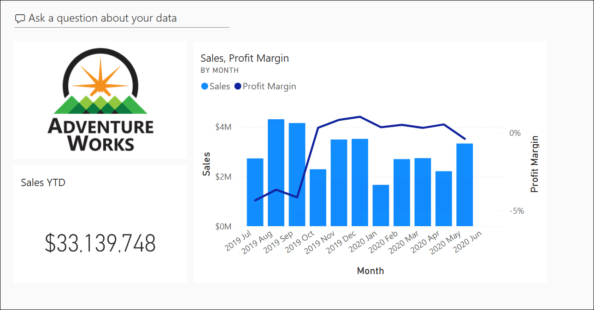

### Task 5: Edit tile details

In this task you will edit the details of two tiles.

1. Hover the cursor over the **Sales YTD** tile, and then at the top-right of the tile, click the ellipsis (...) **(1)**, and then select **Edit Details (2)**.

    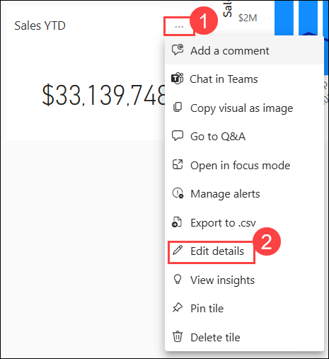

2. In the **Tile Details** pane (located at the right), in the **Subtitle** box, enter **FY2020 (1)**.

3. Click **Apply (2)**.

    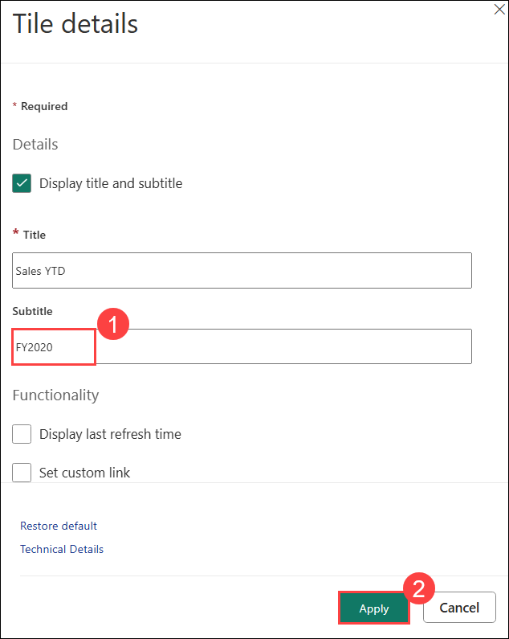

4. Notice that the **Sales YTD** tile displays a subtitle.

    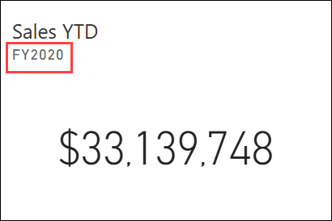

5. Edit the tile details for the **Sales, Profit Margin** tile.

6. In the **Tile Details** pane, in the **Functionality** section, check **Display Last Refresh Time (1)**.

7. Click **Apply (2)**.

    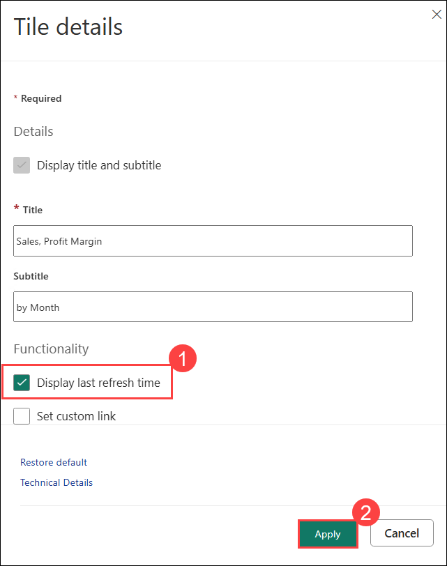

8. Notice that the tile describes the last refresh time (which done when loading the data model in Power BI Desktop).

   >**Note:** You’ll refresh the Semantic model in the next exercise. Typically, this would be achieved by using scheduled refresh, in which case Power BI would use a gateway to connect to the SQL Server database. However, due to constraints in the classroom setup, there is no gateway. So, you’ll open Power BI Desktop, perform a manual data refresh, and then upload the file to your workspace.

## Exercise 2: Refresh the Semantic model

In this exercise you will first load sales order data for June 2020 into the **AdventureWorksDW2020** database. You will then open your Power BI Desktop file, perform a data refresh, and then upload the file to your workspace.

> **Note:** If you're unable to connect to the database, you can use the **12-Solution-Sales-Analysis.pbix** file. Instead of updating the database and refreshing the semantic model, upload the solution file to **My workspace** and see the changes referenced in the following tasks.

### Task 1: Update the lab database

In this task you will run a PowerShell script to update data in the **AdventureWorksDW2020** database.

1. Open File Explorer, navigate to **C:\PL300\PL-300-Microsoft-Power-BI-Data-Analyst-Main\Allfiles\Labs\12-create-power-bi-dashboard** folder, right-click the **UpdateDatabase-2** file and open in notepad.

1. Update the below path in the file and save **(CTRL + S)**

    ```
    C:\PL300\PL-300-Microsoft-Power-BI-Data-Analyst-Main\Allfiles\Labs\12-create-power-bi-dashboard\ResellerSales_202006.csv
    ```

    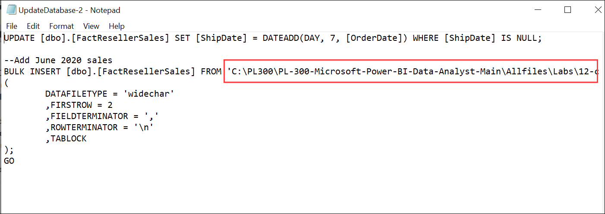

1. In File Explorer, inside the **C:\PL300\PL-300-Microsoft-Power-BI-Data-Analyst-Main\Allfiles\Labs\12-create-power-bi-dashboard** folder, right-click the **UpdateDatabase-2-AddSales.ps1** file, and then open in notepad.

1. In Notepad, locate the `Invoke-SqlCmd` command, add `-TrustServerCertificate` at the end of the line, then **Save (CTRL + S)** the file and close Notepad.

    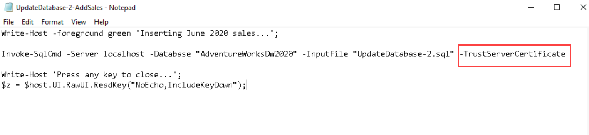

1. Navidate File Explorer, inside the **C:\PL300\PL-300-Microsoft-Power-BI-Data-Analyst-Main\Allfiles\Labs\12-create-power-bi-dashboard** folder, right-click the **UpdateDatabase-2-AddSales.ps1** file, and then select **Run with PowerShell**.

    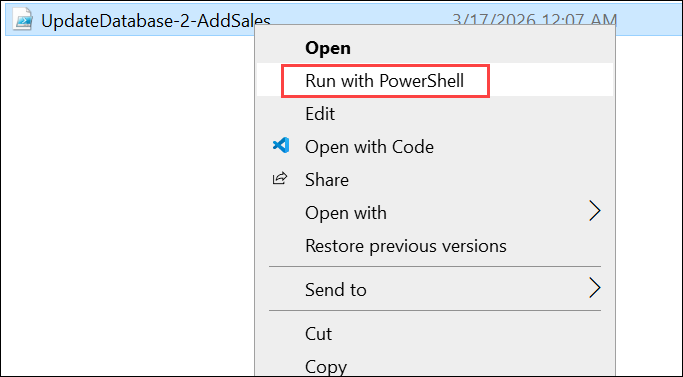

2. If prompted to change the execution policy, press **A**.

3. When prompted to press any key to close, press **Enter** again.

    > **Note:** The **AdventureWorksDW2020** database now includes sales orders made in June 2020.

### Task 2: Refresh the Power BI Desktop file

In this task you will open the **Sales Analysis** Power BI Desktop file, perform a data refresh, and then upload the file to your **Sales Analysis** workspace.

1. In Power BI Desktop file, in the **Data** pane, right-click the **Sales** table, and then select **Refresh (1) > Data (2)**.

     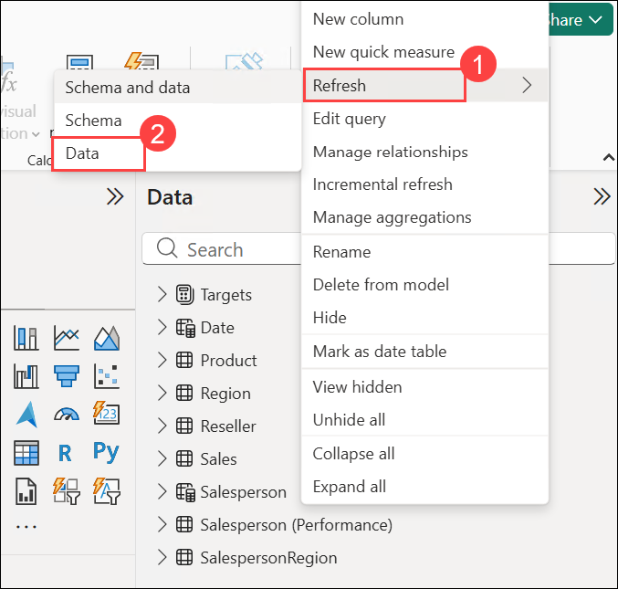

1. In the **SQL Server database** dialog, select **Use my current credentials**, and then choose **Connect**.

    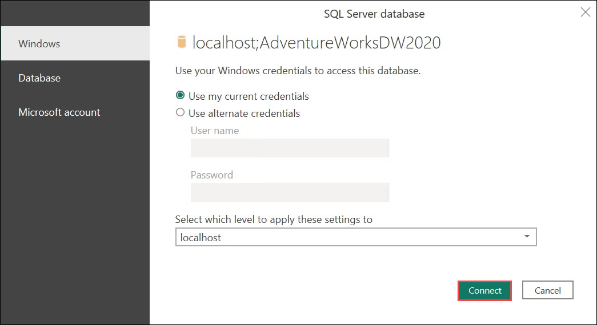

1. In the **Encryption Support** dialog, select **OK**.

2. Save the Power BI Desktop file.

3. To publish the file to your workspace, on the **Home** ribbon tab, from inside the **Share** group, click **Publish** and then click **Select** to publish.

    

1. In the **Publish to Power BI** dialog, select **My workspace (1)**, and then choose **Select (2)**.

    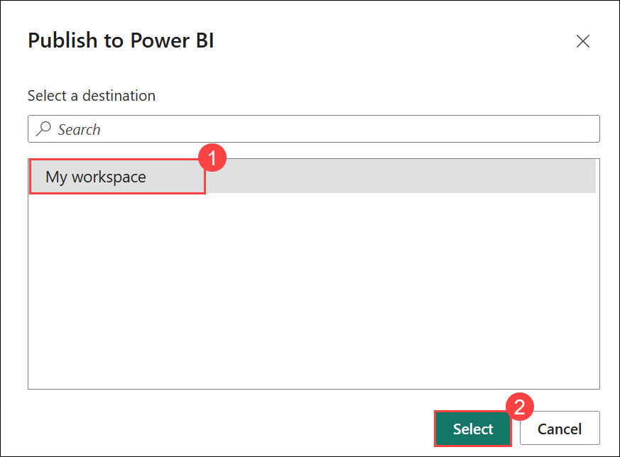

1. In the **Replace this dataset?** dialog, select **Replace**.

    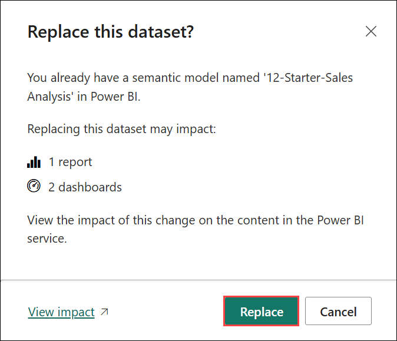

    >**Note:** The Semantic model in the Power BI service now has June 2020 sales data.

1. In the **Publishing to Power BI** dialog, select **Got it**.

    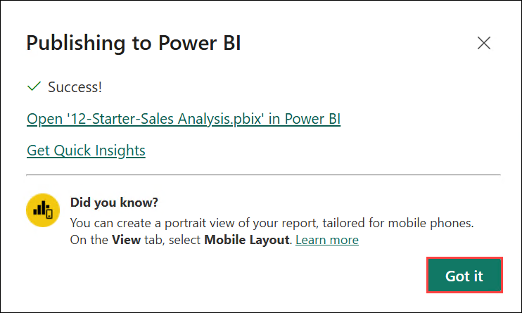

## Exercise 3: Review the Dashboard

In this exercise you will review the dashboard to notice updated sales.

### Task 1: Review the dashboard

In this task you will review the dashboard to notice updated sales.

1. In the Microsoft Edge browser window, in the Power BI service, review the **Sales Monitoring** dashboard.

    > **Note:** If you don’t see the June 2020 data, refresh the browser.

2. In the **Sales, Profit Margin** tile, in the subtitle, notice that the data was **REFRESHED:NOW**.

3. Notice also that there is now a column for **2020 Jun**.

    >**Note:** If you don’t see the June 2020 data, you might need to press **F5** to reload the web browser.

    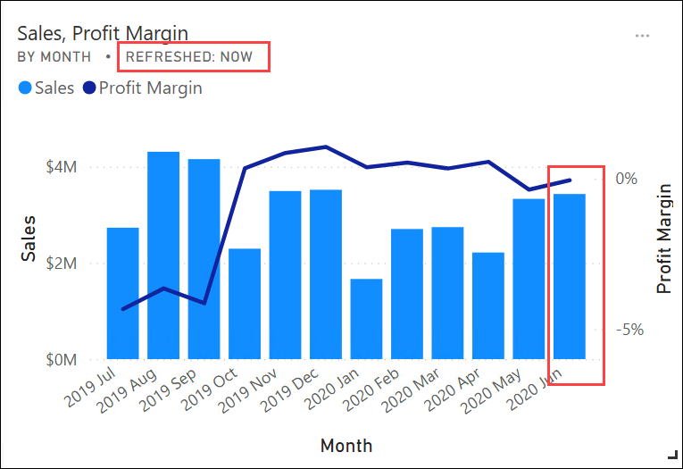

## Review
 
 In this lab, you have completed the following :
- Create a Dashboard
- Refresh the Semantic model
- Review the Dashboard

## You have successfully completed the lab
