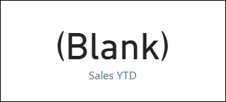
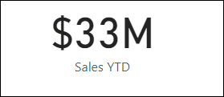
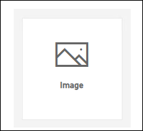
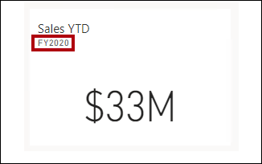

# PL-300 Module 9: Create a Power BI Dashboard

## Lab scenario
 
In this lab you will create the **Sales Monitoring** dashboard.

In this lab you learn how to:

- Pin visuals to a dashboard

- Use Q&A to create dashboard tiles

### **Lab story**

This lab is one of many in a series of labs designed as a complete story from data preparation to publication as reports and dashboards. You can complete the labs in any order. However, if you intend to work through multiple labs, for the first 10 labs, we suggest you do them in the following order:

1. Prepare Data in Power BI Desktop

2. Load Data in Power BI Desktop

3. Model Data in Power BI Desktop

4. Create DAX Calculations in Power BI Desktop

5. Create Advanced DAX Calculations in Power BI Desktop

6. Design a Report in Power BI Desktop

7. Enhance a Report in Power BI Desktop

8. Perform Data Analysis in Power BI Desktop

9. **Create a Power BI Dashboard**

10. Enforce Row-Level Security

## Lab objectives
In this lab, you will perform:

- Pin visuals to a dashboard
- Use Q&A to create dashboard tiles

## Estimated timing: 60 minutes    

## Architecture Diagram

   

## Exercise 1: Create a Dashboard

In this exercise, you will create the **Sales Monitoring** dashboard. The completed dashboard will look like the following:

### Task 1: Get started – Sign in

In this task you will setup the environment for the lab by signing in to Power BI.

**Important**: If you have already signed in to Power BI in a previous lab, continue from the next task.

1. To open Microsoft Edge, on the taskbar, click the Microsoft Edge program shortcut.

    

2. In the Microsoft Edge browser window, navigate to **https://powerbi.microsoft.com**.

    **Tip**: You can also use the Power BI Service favorite on the Microsoft Edge favorites bar.

3. Click **Sign In** (located at the top-right corner).

    

4. If prompted, enter the account details 

   - Enter the Lab username in **Enter your email address** page.
     * Azure Username/Email: <inject key="AzureAdUserEmail"></inject> 
     
   - Complete the sign up process by selecting the username

   - Enter the password 
   
     * Azure Password: <inject key="AzureAdUserPassword"></inject>

5. If prompted to update the password, reenter the provided password, and then enter and confirm a new password.

    **Important**: Be sure to record your new password.

6. Complete the sign in process by clicking on **Continue**.

   

1. Enter a 10 digit phone number and select Get started. Select Get started once more. You will be redirected to Power BI.
   
   .png)
   
   .png)

7. If prompted by Microsoft Edge to stay signed in, click **Yes**.

8. In the Microsoft Edge browser window, in the Power BI service, in the **Navigation** pane, expand **My Workspace**.

    

9. Leave the Microsoft Edge browser window open.

### **Task 2: Get started – Open report**

In this task you will setup the environment for the lab by opening the starter report.

**Important**: If you are continuing on from the previous lab (and you completed that lab successfully), do not complete this task; instead, continue from the next task.

1. To open the Power BI Desktop, on the taskbar, click the Microsoft Power BI Desktop shortcut.

    

2. To close the getting started window, at the top-left of the window, click **X**.

    

3. If Power BI Desktop is not signed in to the Power BI service, at the top-right, click **Sign In**.

    

4. Complete the sign in process using the same account used to sign in to the Power BI service.

5. Enter the Lab username in **Enter your email address** page.
    * Azure Username/Email: <inject key="AzureAdUserEmail"></inject> 
    
      

    * Complete the sign up process by selecting the username
  
      
  
6. Enter the password.
    * Azure Password: <inject key="AzureAdUserPassword"></inject>
         
       
       
5. To open the starter Power BI Desktop file, click the **File** ribbon tab to open the backstage view.

6. Select **Open Report**.

    

7. Click **Browse Reports**.

    

8. In the **Open** window, navigate to the **C:\PL300\PL-300-Microsoft-Power-BI-Data-Analyst-prod\Allfiles\Labs\09-create-power-bi-dashboard\Starter** folder.

9. Select the **Sales Analysis** file.

10. Click **Open**.

    

11. Close any informational windows that may open.

12. Notice the yellow warning message beneath the ribbon.

    >**Note**: The message alerts you to the fact that the queries have not been applied to load as model tables.

13. On the **"There are pending changes in your queries that haven't been applied"** warning message, select **Discard Changes**.

	

14. Now you will see another pop up as shown below, select **Discard**.

	

15. If prompted to apply changes, click **Apply Later**.

	

16. To create a copy of the file, click the **File** ribbon tab to open the backstage view.

17. Select **Save As**.

    

18. If prompted to apply changes, click **Apply Later**.

	

19. In the **Save As** window, navigate to the **C:\PL300\PL-300-Microsoft-Power-BI-Data-Analyst-prod\Allfiles\MySolution** folder.

20. Click **Save**.

    
    
    > **Congratulations** on completing the task! Now, it's time to validate it. Here are the steps:

    - Navigate to the Lab Validation Page, from the upper right corner in the lab guide section.
    - Hit the Validate button for the corresponding task. If you receive a success message, you can proceed to the next task. 
    - If not, carefully read the error message and retry the step, following the instructions in the lab guide.
    - If you need any assistance, please contact us at labs-support@spektrasystems.com. We are available 24/7 to help you out.

### Task 3: Get started – Publish the report

In this task you will setup the environment for the lab by creating a Semantic model.

**Important**: If you have already published the report in the **Design a Report in Power BI Desktop, Part 2** lab, continue from the next task.

1. In the Microsoft Edge browser window, in the Power BI service, navigate to My Workspace.
    
1. Select **Upload > Browse**.

1. In the **Open** window, navigate to the **C:\PL300\PL-300-Microsoft-Power-BI-Data-Analyst-prod\Allfiles\Labs\09-create-power-bi-dashboard\Starter** folder.

1. Select the **Sales Analysis.pbix** file, and then click **Open**.

1. If prompted to replace the Semantic model, click **Replace it**.

### Task 4: Create a dashboard

In this task you will create the **Sales Monitoring** dashboard. You will pin a visual from the report, and add a tile based on an image data URI, and use Q&A to create a tile.

1. In the Microsoft Edge browser window, in the Power BI service, open the **Sales Analysis** report.

2. In the **Overview** page, set the **Year** slicer to **FY2020**.

    

3. Set the **Region** slicer to **Select All**.

    >**Note**: When pinning visuals to a dashboard, they will use the current filter context. Once pinned, the filter context cannot be changed. For time-based filters, it’s a better idea to use a relative date slicer (or, Q&A using a relative time-based question).

4. To create a dashboard and pin a visual, hover the cursor over the **Sales and Profit Margin by Month** (column/line) visual, and select the **pushpin**.

    

5. In the **Pin to Dashboard** window, in the **Dashboard Name** box, enter **Sales Monitoring**.

    

6. Click **Pin**.

    

7. On the **Navigation** pane, select **My Workspace** and then open the **Sales Monitoring** dashboard.

    

8. Notice that the dashboard has a single tile.

    

9. To add a tile based on a question, at the top-left of the dashboard, click **Ask a Question About Your Data**.

    

    >**Note**: You can use the Q&A feature to ask a question, and Power BI will respond will a visual.

10. Click any one of the suggested questions beneath the Q&A box, in the boxes.

11. Review the response.

12. Remove all text from the Q&A box.

13. In the Q&A box, enter the following: **Sales YTD**

    

14. Notice the response of **(Blank)**.

    

    >**Note**: You may recall you added the **Sales YTD** measure in the **Create DAX Calculations in Power BI Desktop, Part 2** lab. This measure is a Time Intelligence expression and it so requires a filter on the **Date** table to produce a result.

15. Extend the question with: **in year FY2020**.

    

16. Notice the response is now **$33M**.

     

     > **Note:** You might get the different value in response.

17. To pin the response to the dashboard, at the top-right corner, click **Pin Visual**.

    

18. When prompted to pin the tile to the dashboard, click **Pin**.

    

19. To return to the dashboard, at the top-left corner, click **Exit Q&amp;A**.

    

20. To add the company logo, on the menu bar, click **Edit**, and then select **Add a Tile**.

    

    >**Note**: Using this technique to add a dashboard tile lets you embellish your dashboard with media, including web content, images, richly-formatted text boxes, and video (using YouTube or Vimeo links).

21. In the **Add a Tile** pane (located at the right), select the **Image** tile.

    

22. Click **Next**.

    

23. In the **Add Image Tile** pane, in the **URL** box, enter the complete URL found in the **C:\PL300\PL-300-Microsoft-Power-BI-Data-Analyst-prod\Allfiles\Resources\AdventureWorksLogo_DataURL.txt** file.

    >**Note**: You can embed an image by using its URL, or you can use a data URL, which embeds content inline.

24. At the bottom of the pane, click **Apply**.

    

25. To resize the logo tile, drag the bottom-right corner, and resize the tile to become one unit wide, and two units high.

    >**Note**: Tile sizes are constrained into a rectangular shape. It’s only possible to resize into multiples of the rectangular shape.

26. Organize the tiles so that the logo appears at the top-left, with the **Sales YTD** tile beneath it, and the **Sales, Profit Margin** tile at the right.

    

    > **Congratulations** on completing the task! Now, it's time to validate it. Here are the steps:

    - Navigate to the Lab Validation Page, from the upper right corner in the lab guide section.
    - Hit the Validate button for the corresponding task. If you receive a success message, you can proceed to the next task. 
    - If not, carefully read the error message and retry the step, following the instructions in the lab guide.
    - If you need any assistance, please contact us at labs-support@spektrasystems.com. We are available 24/7 to help you out.

### Task 5: Edit tile details

In this task you will edit the details of two tiles.

1. Hover the cursor over the **Sales YTD** tile, and then at the top-right of the tile, click the ellipsis, and then select **Edit Details**.

    

2. In the **Tile Details** pane (located at the right), in the **Subtitle** box, enter **FY2020**.

    

3. Click **Apply**.

    

4. Notice that the **Sales YTD** tile displays a subtitle.

    

5. Edit the tile details for the **Sales, Profit Margin** tile.

6. In the **Tile Details** pane, in the **Functionality** section, check **Display Last Refresh Time**.

    

7. Click **Apply**.

    

8. Notice that the tile describes the last refresh time (which done when loading the data model in Power BI Desktop).

   >**Note**: *You’ll refresh the Semantic model in the next exercise. Typically, this would be achieved by using scheduled refresh, in which case Power BI would use a gateway to connect to the SQL Server database. However, due to constraints in the classroom setup, there is no gateway. So, you’ll open Power BI Desktop, perform a manual data refresh, and then upload the file to your workspace.

## Exercise 2: Refresh the Semantic model

In this exercise you will first load sales order data for June 2020 into the **AdventureWorksDW2020** database. You will then open your Power BI Desktop file, perform a data refresh, and then upload the file to your workspace.

### Task 1: Update the lab database

In this task you will run a PowerShell script to update data in the **AdventureWorksDW2020** database.

1. In File Explorer, inside the **C:\PL300\PL-300-Microsoft-Power-BI-Data-Analyst-prod\Allfiles\Setup** folder, right-click the **UpdateDatabase-2-AddSales.ps1** file, and then select **Run with PowerShell**.

    

2. If prompted to change the execution policy, press **A**.

3. When prompted to press any key to close, press **Enter** again.

    >**Note**: The **AdventureWorksDW2020** database now includes sales orders made in June 2020.

### Task 2: Refresh the Power BI Desktop file

In this task you will open the **Sales Analysis** Power BI Desktop file, perform a data refresh, and then upload the file to your **Sales Analysis** workspace.

1. In Power BI Desktop file, in the **Fields** pane, right-click the **Sales** table, and then select **Refresh Data**.

    

2. When the refresh completes, save the Power BI Desktop file.

3. To publish the file to your workspace, on the **Home** ribbon tab, from inside the **Share** group, click **Publish** and then click **Select** to publish.

    

4. When prompted to replace the Semantic model, click **Replace**.

    

    >**Note**: The Semantic model in the Power BI service now has June 2020 sales data.

5. Close Power BI Desktop.

## Exercise 3: Review the Dashboard

In this exercise you will review the dashboard to notice updated sales.

### Task 1: Review the dashboard

In this task you will review the dashboard to notice updated sales.

1. In the Microsoft Edge browser window, in the Power BI service, review the **Sales Monitoring** dashboard.

2. In the **Sales, Profit Margin** tile, in the subtitle, notice that the data was **REFRESHED:NOW**.

3. Notice also that there is now a column for **2020 Jun**.

    >**Note**: If you don’t see the June 2020 data, you might need to press **F5** to reload the web browser.

    

## Exercise 4: Finish Up

1. Save the Power BI Desktop file.

2. After you have successfully saved the Power BI Desktop file, navigate to the following `https://bit.ly/uploadreports` within your LabVM environment.

3. Once you are directed to the Sharing Link Validation browser page, perform the following steps to access the private sharepoint directory:
	- Within the **Enter password (1)** field, type in the following password: `RRCCollegeReports@1`
 	- Click on the **Verify (2)** button.

	

4. To upload the recently saved Power BI Desktop file within the **CloudLabs Projects** sharepoint private group, perform the following steps:

	>**Note:** If you have already created a folder based on your name, you can ignore this step and resume execution from **Step 6**.
 
 	- Click on the **+ New (1)** button and then select **Folder (2)**.
 	- On the **Create a folder** dialog-box, enter a name for the folder in the following format: <`First Name` `First Name`> **(3)**.
	- Click on the **Create (4)** button.
	
 	

	

5. Click on the newly created folder with your name.

6. Ensuring that you are within the newly created folder (on your name), perform the following steps to create a sub folder:
	- Click on the **+ New (1)** button and then select **Folder (2)**.
 	- On the **Create a folder** dialog-box, name the folder with the following name based on the value of the Deployment ID: **<inject key="Deployment ID"></inject> (3)**.
  	- Click on the **Create (4)** button.  
  	- Select the newly created folder.

	

	

7. To upload the Power BI Desktop file within the newly created sub folder, perform the following steps:
	- Click on **Upload (1)**.
 	- Select **Files (2)** from the dropdown list.
 	- Navigate to the **C:\PL300\PL-300-Microsoft-Power-BI-Data-Analyst-prod\Allfiles\MySolution** folder and upload the **Sales Analysis.pbix** file.
	
 	

## Review
 In this lab, you have completed the following :
- Create a Dashboard
- Refresh the Semantic model
- Review the Dashboard

## You have successfully completed the lab
