# Lab 11: Secure data access in Power BI

## Lab scenario
In this lab, you'll enforce row-level security to ensure that a salesperson can only analyze sales data for their assigned region(s).

In this lab you learn how to:

- Implement dynamic row-level security (RLS) in Power BI.

- Create and test a role using USERPRINCIPALNAME().

## Lab objectives

In this lab, you will perform:

- Configure many-to-many relationships
- Enforce row-level security

## Estimated timing: 60 Minutes    

## Architecture Diagram

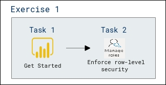

## Exercise 1: Enforce row-level security

In this exercise you will enforce row-level security to ensure a salesperson can only ever see sales made in their assigned region(s).

### Task 1: Get started

In this task you will setup the environment for the lab by opening the starter report.

1. Click the Microsoft **Power BI Desktop** shortcut icon to open.

 	

1. To open the starter Power BI Desktop file, click the **Open (1)** button at left panel and select **Browse this device (2)**.

	

1. In the **Open** window, navigate to the **C:\PL300\PL-300-Microsoft-Power-BI-Data-Analyst-Main\Allfiles\Labs\11-secure-data-access (1)** folder. Select the **11-Starter-Sales Analysis (2)** file and click **Open (3)**.

   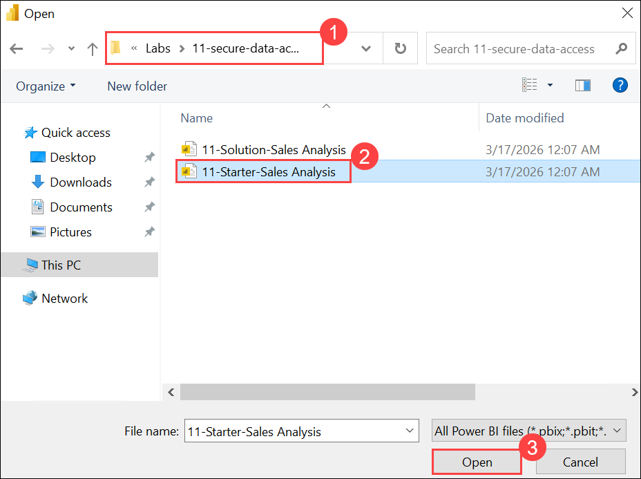

1. Close any informational windows that may open.

1. If prompted to apply changes, click **Apply Later**.

    

### Task 2: Enforce row-level security

In this task you will enforce row-level security to ensure a salesperson can only see sales made in their assigned region(s).

1. On the left navigation pane, select the **Table view**.
	
	 

2. In the **Data** pane, select the **Salesperson (Performance)** table.

	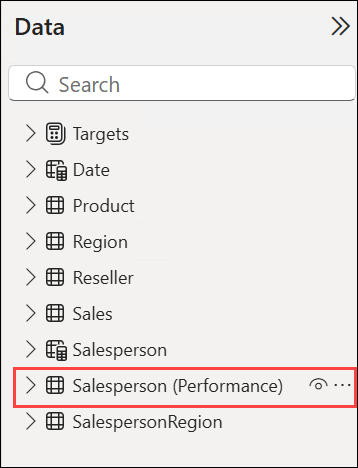

3. Review the data, noticing that Michael Blythe (EmployeeKey 281) has a UPN value of: *michael-blythe@adventureworks.com*

	>**Note:** Recall that Michael Blythe is assigned to three sales regions: US Northeast, US Central, and US Southeast.

5. On the **Home** ribbon tab, from inside the **Security** group, click **Manage roles**.

	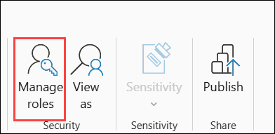

1. In the **Manage security roles** window, in the **Roles** section, select **New**.

	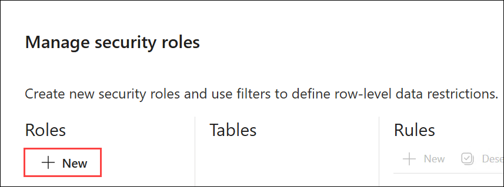

7. In the box, replace the selected text with the name of the role: **Salespeople**, and then press **Enter**.

	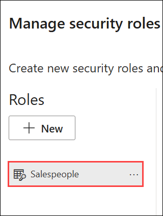

1. To assign a filter, select the **Salesperson (Performance) (1)** table, and then select **Switch to DAX editor (2)** in the **Rules** section.

	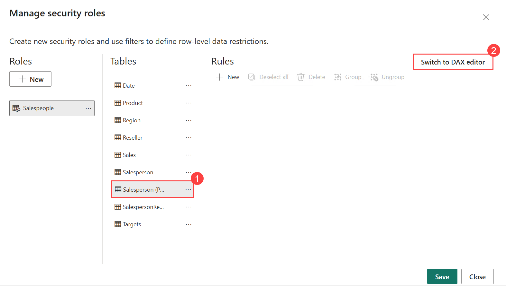

1. In the DAX editor box, enter the following expression **(1)**:

    ```DAX
    [UPN] = USERPRINCIPALNAME()
    ```

    > **Note:** USERPRINCIPALNAME() is a Data Analysis Expressions (DAX) function that returns the name of the authenticated user. It means that the **Salesperson (Performance)** table will filter by the User Principal Name (UPN) of the user querying the model.

1. Select **Save (2)** and **Close**.

	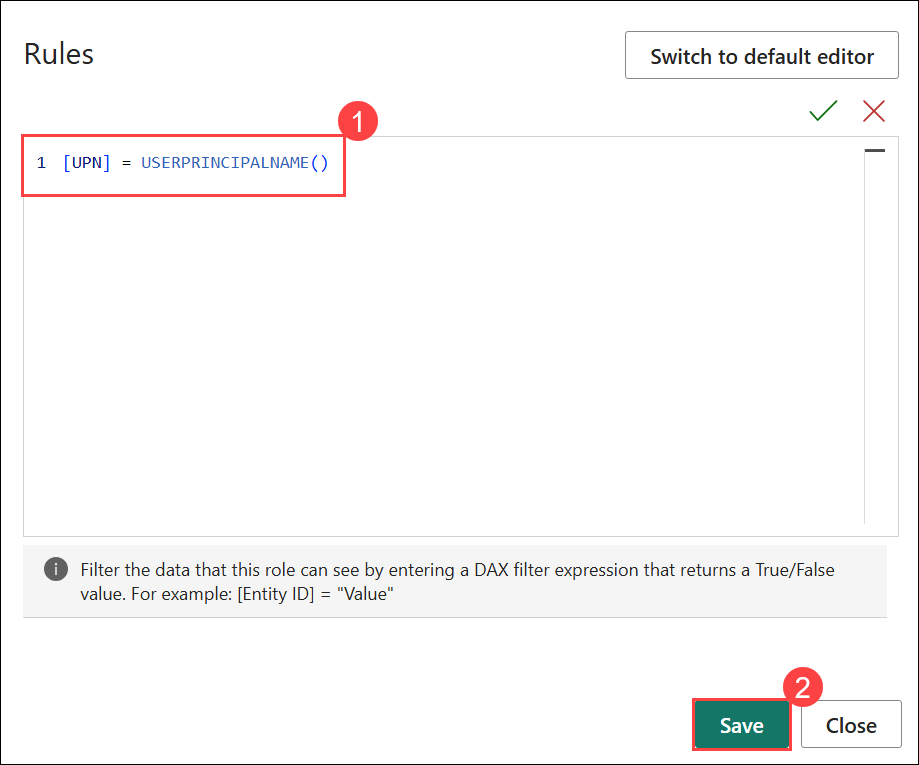

11. To test the security role, on the **Home** ribbon tab, from inside the **Security** group, click **View as**.

	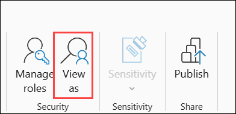

12. In the **View as Roles** window, check the **Other User (1)** item, and then in the corresponding box, enter: **michael-blythe@adventureworks.com (2)**

13. Check the **Salespeople (3)** role, and then click **OK (4)**. 

	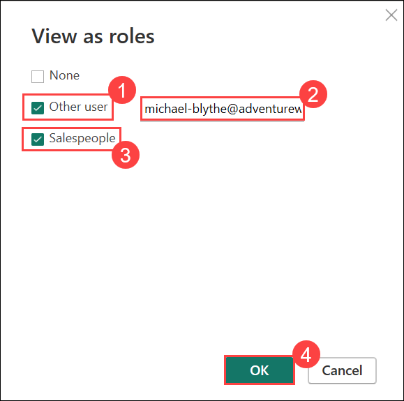

	>**Note:** This configuration results in using the **Salespeople** role and impersonating the user with your Michael Blythe’s name.

15. Notice the red banner above the report page, describing the test security context.

	

16. Switch to **Report view**

1. In the table visual, notice that only the salesperson **Michael Blythe** is listed.

	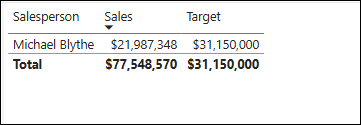

17. To stop testing, at the right side of the red banner, click **Stop Viewing**.

	

	> **Note:** When the Power BI Desktop file is published to the Power BI service, you’ll need to complete a post-publication task to map security principals to the **Salespeople** role. You won’t do that in this lab.

1. To delete the **Salespeople** role, on the **Modeling** ribbon tab, from inside the **Security** group, select **Manage roles**.

	

1. In the **Manage security roles** window, select the ellipsis (...) **(1)** on the **Salespeople** role, and select **Delete (2)**. 

	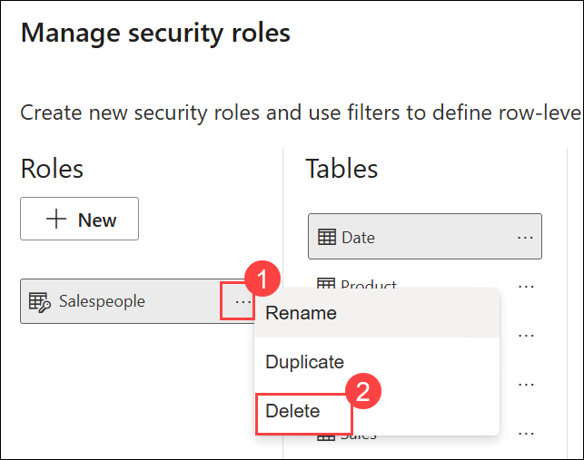

20. When prompted to confirm the deletion, click **Yes, Delete**.

21. Click **Save** and **Close**.

	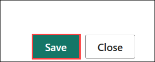

1. Save the Power BI Desktop file.

	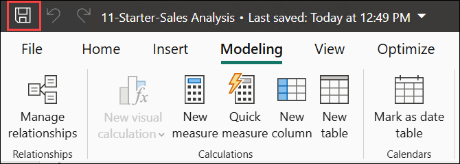

## Review

In this lab, you have completed:

- Enforced row level security.

## You have successfully completed the lab
