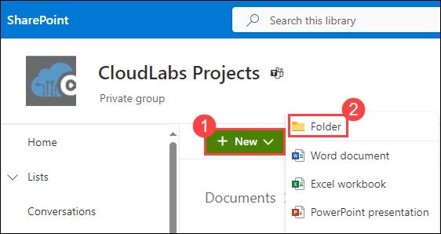
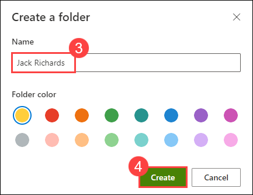
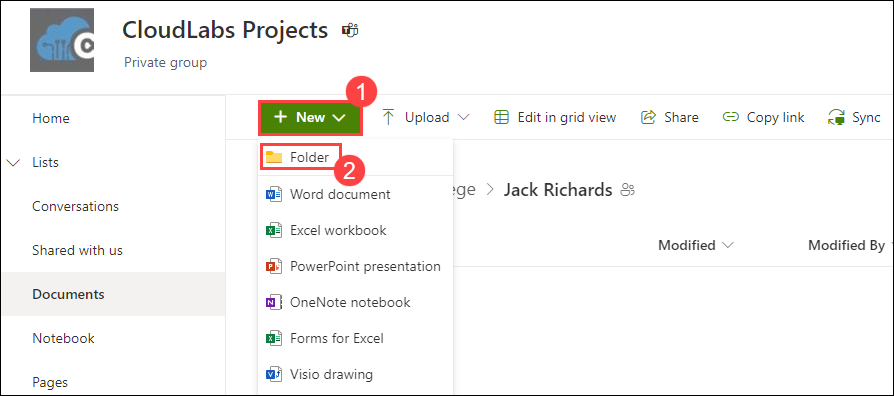
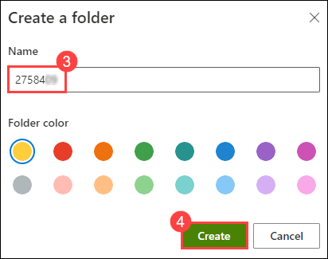

# PL-300 Module 10: Enforce Row-Level Security

## Lab scenario
In this lab you will create a many-to-many relationship between the **Salesperson** table and the **Sales** table. You will also enforce row-level security to ensure that a salesperson can only analyze sales data for their assigned region(s).

In this lab you learn how to:

- Configure many-to-many relationships

- Enforce row-level security

## Lab story

This lab is one of many in a series of labs that was designed as a complete story from data preparation to publication as reports and dashboards. You can complete the labs in any order. However, if you intend to work through multiple labs, for the first 10 labs, we suggest you do them in the following order:

1. Prepare Data in Power BI Desktop

2. Load Data in Power BI Desktop

3. Model Data in Power BI Desktop

4. Create DAX Calculations in Power BI Desktop

5. Create Advanced DAX Calculations in Power BI Desktop

6. Design a Report in Power BI Desktop

7. Enhance a Report in Power BI Desktop

8. Create a Power BI Dashboard

9. Perform Data Analysis in Power BI Desktop

10. **Enforce Row-Level Security**

## Lab objectives
In this lab, you will perform:

- Configure many-to-many relationships
- Enforce row-level security

## Estimated timing: 60 minutes    

## Architecture Diagram

## Exercise 1: Enforce row-level security

In this exercise you will enforce row-level security to ensure a salesperson can only ever see sales made in their assigned region(s).

### Task 1: Get started

In this task you will setup the environment for the lab.

**Important**: If you are continuing on from the previous lab (and you completed that lab successfully), do not complete this task; instead, continue from the next task.

1. To open the Power BI Desktop, on the taskbar, click the Microsoft Power BI Desktop shortcut.

	

1. To close the getting started window, at the top-left of the window, click **X**.

	
	
1. To sign in to the Power BI service, at the top-right, click **Sign In**.

	
	
1. Complete the sign in process using the same account used to sign in to the Azure portal.

1. Enter the Lab username in **Enter your email address** page.
    * Azure Username/Email: <inject key="AzureAdUserEmail"></inject> 
    
      

    * Complete the sign up process by selecting the username
  
      
  
1. Enter the password.
    * Azure Password: <inject key="AzureAdUserPassword"></inject>
         
       
       
1. Complete the sign in process by clicking on **Continue**

   
   
1. Enter a 10 digit phone number and select Get started. Select Get started once more. You will be redirected to Power BI.
   
   .png)
   
   .png)
   
1. Leave the Microsoft Edge browser window open.

1. Navigate back to **Power BI Desktop**

1. To open the starter Power BI Desktop file, click the **File** ribbon tab to open the backstage view.

1. Select **Open Report**.

	.png)

1. Click **Browse Reports**.

	

1. In the **Open** window, navigate to the **C:\PL300\PL-300-Microsoft-Power-BI-Data-Analyst-prod\AllFiles\Labs\10-row-level-security\Starter** folder.

1. Select the **Sales Analysis** file.

1. Click **Open**.

	

1. Close any informational windows that may open.

1. On the **"There are pending changes in your queries that haven't been applied"** warning message, select **Discard Changes**.

	.png)

1. Now you will see another pop up as shown below, select **Discard**.

	.png)

1. To create a copy of the file, click the **File** ribbon tab to open the backstage view.

1. Select **Save As**.

	
	
1. If prompted to apply changes, click **Apply Later**.

1. In the **Save As** window, navigate to the **C:\PL300\PL-300-Microsoft-Power-BI-Data-Analyst-prod\AllFiles\MySolution** folder.

1. Click **Save**.

	

   > **Congratulations** on completing the task! Now, it's time to validate it. Here are the steps:
	
	- Navigate to the Lab Validation Page, from the upper right corner in the lab guide section.
	- Hit the Validate button for the corresponding task. If you receive a success message, you can proceed to the next task. 
	- If not, carefully read the error message and retry the step, following the instructions in the lab guide.
	- If you need any assistance, please contact us at labs-support@spektrasystems.com. We are available 24/7 to help you out.

### Task 2: Enforce row-level security

In this task you will enforce row-level security to ensure a salesperson can only see sales made in their assigned region(s).

1. Switch to Data view.

	

2. In the **Fields** pane, select the **Salesperson (Performance)** table.

3. Review the data, noticing that Michael Blythe (EmployeeKey 281) has a UPN value of: *michael-blythe@adventureworks.com*

	>**Note**: Recall that Michael Blythe is assigned to three sales regions: US Northeast, US Central, and US Southeast.

4. Switch to Report view.

5. On the **Modeling** ribbon tab, from inside the **Security** group, click **Manage Roles**.

	

6. In the **Manage Roles** window, click **Create**.

	

7. In the box, replace the selected text with the name of the role: **Salespeople**, and then press **Enter**.

	

8. To assign a filter, for the **Salesperson (Performance)** table, click the ellipsis (…) character, and then select **Add Filter \| [UPN]**.

	

9. In the **Table Filter DAX Expression** box, modify the expression by replacing **“Value”** with **USERPRINCIPALNAME()**.

	

	>**Note**: USERPRINCIPALNAME() is a Data Analysis Expressions (DAX) function that returns the name of the authenticated user. It means that the **Salesperson (Performance)** table will filter by the User Principal Name (UPN) of the user querying the model.

10. Click **Save**.

	

11. To test the security role, on the **Modeling** ribbon tab, from inside the **Security** group, click **View As**.

	

12. In the **View as Roles** window, check the **Other User** item, and then in the corresponding box, enter: *michael-blythe@adventureworks.com*

13. Check the **Salespeople** role.

	

	>**Note**: This configuration results in using the **Salespeople** role and impersonating the user with your Michael Blythe’s name.

14. Click **OK**.

	

15. Notice the yellow banner above the report page, describing the test security context.

	

16. In the table visual, notice that only the salesperson **Michael Blythe** is listed.

	

17. To stop testing, at the right side of the yellow banner, click **Stop Viewing**.

	

	>**Note**: When the Power BI Desktop file is published to the Power BI service, you’ll need to complete a post-publication task to map security principals to the **Salespeople** role. You won’t do that in this lab.

18. To delete the role, on the **Modeling** ribbon tab, from inside the **Security** group, click **Manage Roles**.

	

19. In the **Manage Roles** window, click **Delete**.

	

20. When prompted to confirm the deletion, click **Yes, Delete**.

21. Click **Save**.

	

### Task 3: Finish up

In this task you will complete the lab.

1. Save the Power BI Desktop file.

2. After you have successfully saved the Power BI Desktop file, navigate to the following `https://bit.ly/uploadreports` within your LabVM environment.

3. Once you are directed to the Sharing Link Validation browser page, perform the following steps to access the private sharepoint directory:
	- Within the **Enter password (1)** field, type in the following password: `RRCCollegeReports@1`
 	- Click on the **Verify (2)** button.

	

4. To upload the recently saved Power BI Desktop file within the **CloudLabs Projects** sharepoint private group, perform the following steps:

	>**Note:** If you have already created a folder based on your name, you can ignore this step and resume execution from **Step 6**.
 
 	- Click on the **+ New (1)** button and then select **Folder (2)**.
 	- On the **Create a folder** dialog-box, enter a name for the folder in the following format: <`First Name` `Last Name`> **(3)**.
	- Click on the **Create (4)** button.
	
 	

	

5. Click on the newly created folder with your name.

6. Ensuring that you are within the newly created folder (on your name), perform the following steps to create a sub folder:
	- Click on the **+ New (1)** button and then select **Folder (2)**.
 	- On the **Create a folder** dialog-box, name the folder with the following name based on the value of the Deployment ID: **<inject key="Deployment ID"></inject> (3)**.
  	- Click on the **Create (4)** button.  
  	- Select the newly created folder.

	

	

7. To upload the Power BI Desktop file within the newly created sub folder, perform the following steps:
	- Click on **Upload (1)**.
 	- Select **Files (2)** from the dropdown list.
 	- Navigate to the **C:\PL300\PL-300-Microsoft-Power-BI-Data-Analyst-prod\Allfiles\MySolution** folder and upload the **Sales Analysis.pbix** file.
	
 	

## Review
In this lab, you have completed:
- Enforced row level security.

## You have successfully completed the lab
