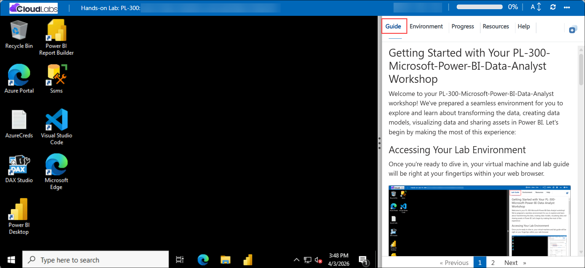
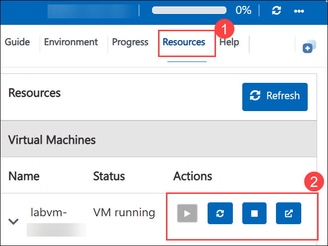
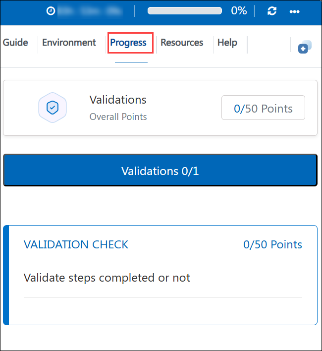

# Getting Started with Your PL-300-Microsoft-Power-BI-Data-Analyst Workshop
 
Welcome to your PL-300-Microsoft-Power-BI-Data-Analyst workshop! We've prepared a seamless environment for you to explore and learn about transforming the data, creating data models, visualizing data and sharing assets in Power BI. Let's begin by making the most of this experience:

## Objectives

By the end of the labs you will be able to:

1. **Connect and preview data:** Connect to common data sources (SQL Server, CSV), import data into Power BI Desktop, and assess data quality using Power Query profiling tools.
2. **Cleanse and transform data:** Apply Power Query transformations to shape, clean, and prepare query tables and load them into the semantic model.
3. **Design the semantic model:** Create relationships, hierarchies, display folders, and configure table and column properties to make the model author-friendly.
4. **Create DAX calculations:** Implement calculated tables, calculated columns, and measures for aggregations, business logic, and reporting.
5. **Manipulate filter context & time intelligence:** Use DAX (e.g., `CALCULATE()`, TOTALYTD, PARALLELPERIOD) to build YTD, YoY, and other advanced measures.
6. **Build visual calculations & analytics:** Create visual-level calculations (running totals, moving averages), animated visuals, and forecasts to analyze trends.
7. **Design interactive reports:** Build multi-page reports with slicers, synced slicers, formatted visuals, and user-friendly layouts.
8. **Publish and share:** Publish datasets and reports to the Power BI service, create dashboards, pin tiles, and use Q&A for ad-hoc queries.
9. **Perform analytics and forecasting:** Use built-in analytics features such as animated scatter charts and forecasting to explore and predict outcomes.
10. **Secure report access:** Implement row-level security (RLS) using dynamic filters (e.g., `USERPRINCIPALNAME()`), test roles, and validate access in the Power BI service.

## Pre-requisites

- **Basic Power BI knowledge:** Familiarity with the Power BI Desktop interface, report canvas, creating visuals, and basic measures or queries.

- **Database Knowledge:** The sample database is used throughout the labs, restore steps and backup files are included in the workspace.

- **Basic data skills:** Familiarity with tables, keys, and basic SQL or Excel concepts makes the labs easier to follow.

- **Power BI Desktop:** Ensure Power BI Desktop is available and the starter PBIX files can be opened during the labs.

- **Basic Power Query familiarity:** Comfortable with basic Get & Transform operations such as filtering, merging, and reviewing applied steps.

## Architecture

The labs demonstrate the typical Power BI authoring-to-deployment architecture used in analytics projects:

1. **Data sources:** An on-premises or lab-hosted SQL Server instance containing AdventureWorksDW2020 and supporting CSV files used to build the model.

2. **Power Query:** Power BI Desktop's Get & Transform layer extracts, profiles, and applies transformations to source data, producing query tables.

3. **Semantic model:** Tables, relationships, hierarchies, and measures defined in Power BI Desktop form the dataset that underpins reports and dashboards.

4. **DAX calculation engine:** Performs calculated columns, calculated tables, measures, and time-intelligence logic used by visuals and service calculations.

5. **Authoring & report canvas:** Report pages and visuals are created and formatted in Power BI Desktop for interactive analysis.

6. **Power BI service:** Published datasets and reports are hosted in the service, where dashboards, Q&A tiles, refresh, and sharing are managed.

7. **Security & governance:** Row-level security is configured in the model and mapped to identities and workspace permissions in the service.

## Explanation of Components

Below are the primary Power BI components and how they map to the lab activities:

1. **Power Query:** Labs 01–02 demonstrate connecting to SQL Server and CSV files, previewing data, profiling columns, and applying transformations to prepare query tables for the model.

2. **Dataflows:** Queries defined in Power Query become dataset tables when loaded, the labs show how to design queries for reliability and reuse.

3. **Semantic Model:** Labs 03–04 cover creating relationships, hierarchies, display folders, and configuring metadata to make the model consumable.

4. **DAX Calculations & Measures:** Labs 04–06 teach calculated tables/columns, measures, `CALCULATE()` usage, and time-intelligence functions (TOTALYTD, PARALLELPERIOD) for business calculations.

5. **Visual Calculations & Analytics:** Labs 07 and 10 show creating visual-level calculations (running totals, moving averages), animated scatter visuals, and forecasting techniques.

6. **Report Design & Interactivity:** Lab 08 guides report layout, slicers, synced slicers, formatting, and interactive visual authoring best-practices.

7. **Power BI Service & Dashboards:** Lab 09 explains publishing datasets/reports, pinning visuals to dashboards, creating Q&A tiles, and performing dataset refreshes.

8. **Row-Level Security :** Lab 11 demonstrates implementing dynamic RLS with `USERPRINCIPALNAME()`, testing roles, and validating restricted views for users.

## Accessing Your Lab Environment
 
Once you're ready to dive in, your virtual machine and **Guide** will be right at your fingertips within your web browser.
 
   

### Virtual Machine & Lab Guide
 
Your virtual machine is your workhorse throughout the workshop. The lab guide is your roadmap to success.
 
## Exploring Your Lab Resources
 
To get a better understanding of your lab resources and credentials, navigate to the **Environment** tab.
 
   
 
## Utilizing the Split Window Feature
 
For convenience, you can open the lab guide in a separate window by selecting the **Split Window** button from the Top right corner.
 
   

## Utilizing the Zoom In/Out Feature

To adjust the zoom level for the environment page, navigate to the **Guide** tab then  click the **A↕ : 100% (2)** icon located next to the timer in the lab environment.

## Managing Your Virtual Machine
 
Feel free to **Start, Stop, or Restart (2)** your virtual machine as needed from the **Resources (1)** tab. Your experience is in your hands!
 
   

## Lab Progress

You can use the **Progress** tab to track your progress while working on the lab. A score will be provided after successful validation.

## Lab Duration Extension

1. To extend the duration of the lab, kindly click the **Hourglass** icon in the top right corner of the lab environment. 

    

    >**Note:** You will get the **Hourglass** icon when 10 minutes are remaining in the lab.

2. Click **OK** to extend your lab duration.
 
   

3. If you have not extended the duration prior to when the lab is about to end, a pop-up will appear, giving you the option to extend. Click **OK** to proceed. 

## Support Contact

The CloudLabs support team is available 24/7, 365 days a year, via email and live chat to ensure seamless assistance at any time. We offer dedicated support channels tailored specifically for both learners and instructors, ensuring that all your needs are promptly and efficiently addressed.

Learner Support Contacts:

   - Email Support: cloudlabs-support@spektrasystems.com

   - Live Chat Support: https://cloudlabs.ai/labs-support

 
Click **Next** from the bottom right corner to embark on your Lab journey!

Now you're all set to explore the powerful world of technology. Feel free to reach out if you have any questions along the way. Enjoy your workshop!

## Happy Learning!!